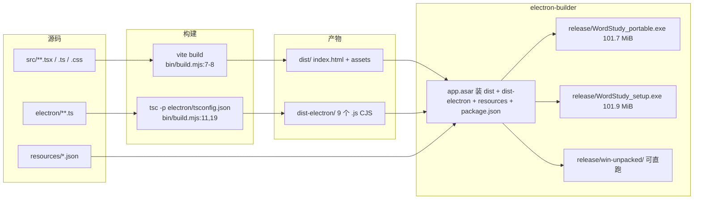
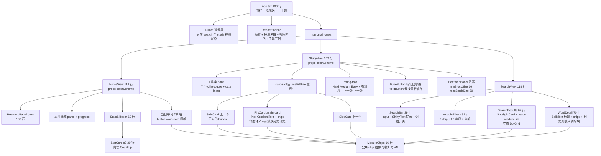
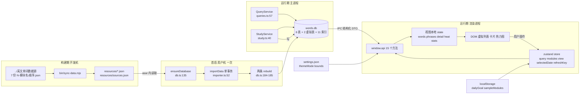
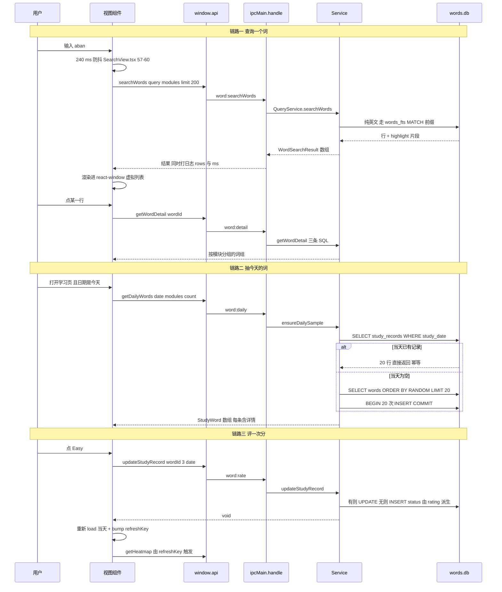
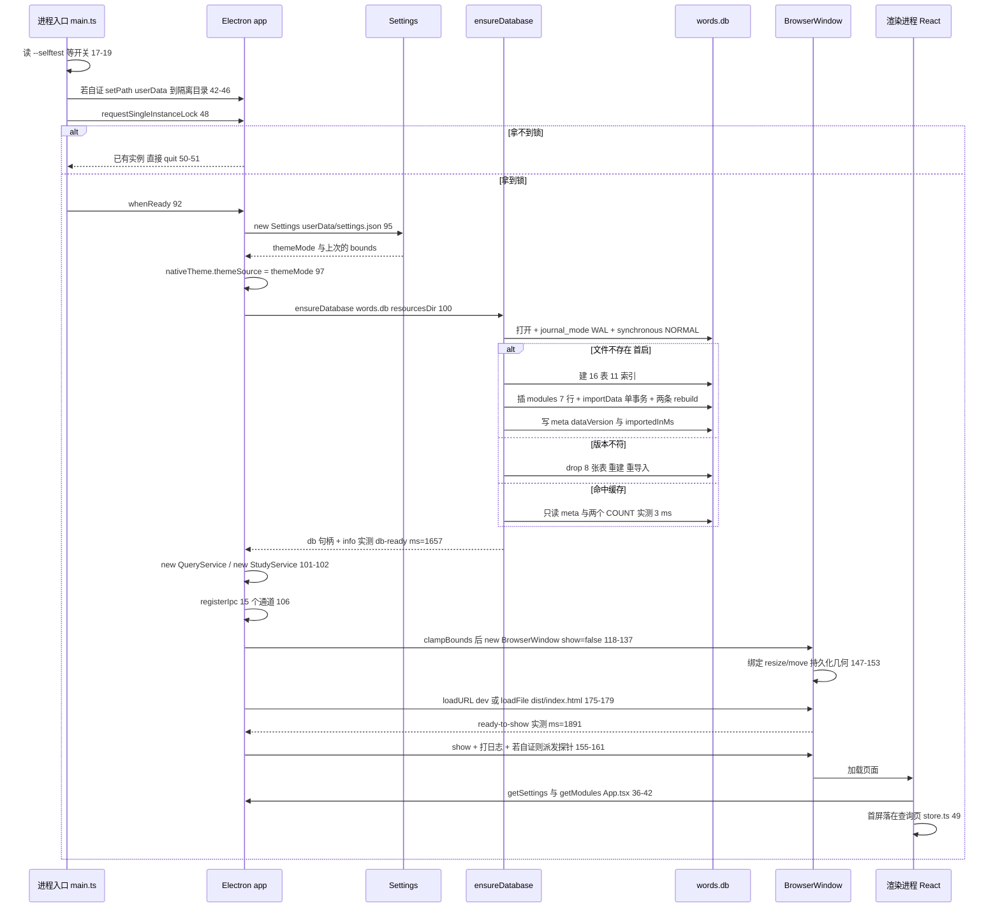
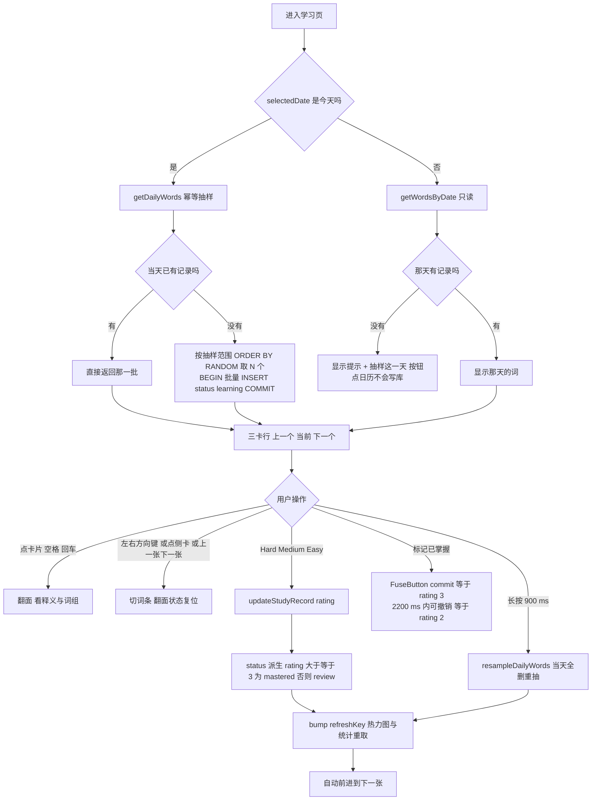

# WordStudy（单词学习）· 项目全景

> 面向：第一次接触这个工程的人，以及需要改它的人。
> 口径：每个结论都带 `文件:行号`；数字要么是本轮实测，要么写明出处（日志文件 / 姊妹文档）。**本文只描述代码当前状态**，不记录历史归因——那些留在 `doc/` 下各自文档里。
> 版本：`package.json` version `1.0.0`、productName `WordStudy`、窗口标题「单词学习」（`package.json:3-4`、`electron/main.ts:13`）。
> 本机环境：Windows 10.0.26300 / x64，Node v24.21.0，Electron 44.5.1。

| 章节 | 内容 |
| --- | --- |
| 1 | 创建目的与解决的问题 |
| 2 | 项目技术栈 |
| 3 | 项目架构 |
| 4 | 代码地图 |
| 5 | 组件架构 |
| 6 | 数据流图 |
| 7 | 工作流程 |
| 8 | 工作原理 |
| 9 | 现状、已知偏差与待决 |
| 附 | 文档分工与复现命令 |

---

## 1. 创建目的与解决的问题

### 1.1 起因

手上有 7 份从不同词书整理出来的 JSON 词库（`../英文单词数据源/`，文件名口径 `N-模块名-顺序.json`），合计 34,169 条词条、190,926 条词组/例句。需要一个**离线、单文件、能查能背**的桌面应用把它们用起来。

### 1.2 解决的具体问题

| 问题 | 数据/代码依据 |
| --- | --- |
| 同一单词在多个词书里重复出现，直接合并会看到 6 份一样的释义 | 34,169 条源条目去重成 14,618 个唯一词，7,808 个词跨 2 个以上词库；关系单独存 `word_modules`（34,134 行）——`electron/importer.ts:63-79`、`doc/数据库表结构与数据流转设计.md` §6.1 |
| 同一个词在不同词书下的词组/例句侧重不同，混在一起就丢了「这是哪一级要求」 | `phrases` 同时挂 `word_id` 与 `module_id`，详情页按模块分组展示——`electron/db.ts:47-58`、`electron/queries.ts:296-320` |
| 中文释义要能子串搜（搜「放弃」要能命中「放弃；抛弃」），英文要能前缀搜（`ab` → `abandon`） | FTS5 只擅长后者，所以含中文的查询直接走 LIKE，英文走 FTS5 前缀，零命中再回落——`electron/queries.ts:11`、`107-119` |
| 19 万行词组的检索不能卡界面（主进程是同步 SQLite） | 全库最慢的一条读（词组中文 LIKE 全表扫）实测 37–40 ms，其余 0–9 ms——`doc/数据库表结构与数据流转设计.md` §7.3 |
| 每日抽词要「同一天打开多少次都是同一批」，但又要能显式换一批 | `UNIQUE(word_id, study_date)` + `ensureDailySample` 幂等、`resampleDailyWords` 显式重抽——`electron/study.ts:92-101` |
| 点日历看历史某天，不能顺手给那天生成记录（会让热力图凭空变绿） | 只有「今天」允许自动抽样，其他日期一律只读，要生成必须显式点按钮——`src/components/study/StudyView.tsx:74-86`、`electron/main.ts` 判据 `viewing-a-day-creates-no-records`（`smoke-out.txt:69`） |
| 坚持度要看得见 | 热力图 + 连续打卡 + 本月掌握率，全部由 `study_records` 聚合——`electron/study.ts:148-209`、`src/components/home/HomeView.tsx:24-38` |
| 不能联网、不能装数据库服务 | 单文件 SQLite 落在 `%APPDATA%\WordStudy\words.db`，发布包里只有 JSON 种子，库在用户机首启时现建——`electron/main.ts:100`、`doc/Json源文件与数据库文件与打包发布.md` |

### 1.3 明确不做的（边界）

- **不做云同步/账号**：数据只在本机 `%APPDATA%`，拷走 `words.db` 就是完整备份（干净退出后 `-wal`/`-shm` 会被 checkpoint 掉）。
- **不做发音朗读**：早期版本有过，已被点名移除；`words.phonetic` 字段留着但 14,618 行全为 NULL（数据源没有音标）。
- **不做用户增删词**：字典层导入后只读，运行时唯一被写入的表是 `study_records`。
- **不做 Anki 式间隔重复**：自评分 1–5 只派生三态（`rating>=3` → `mastered`，否则 `review`，未评为 `learning`），没有下次复习时间——`electron/study.ts:130-133`。
- **不引入 UI 框架**：样式是纯 CSS 令牌 + 手写规则，动效组件来自 vendored ReactBits 种子。

### 1.4 验收方式

用户按编号截图逐轮验收；工程自带一套跑在真实 Electron 里的自证判据（`--selftest`，当前 39 条，`electron/main.ts:1492`），改布局/主题后必须先过判据再看截图。**当前状态是 38 PASS / 1 FAIL，见 §9.1。**

---

## 2. 项目技术栈

### 2.1 分层选型

| 层 | 选型 | 版本（实测） | 为什么是它 |
| --- | --- | --- | --- |
| 桌面运行时 | Electron | 44.5.1（内嵌 Node 24.21.0 / Chrome 152 / SQLite 3.53.4） | 需要本地文件 + 本地库 + 原生窗口；`electron-builder.yml:9` 钉死版本 |
| 数据库 | `node:sqlite`（`DatabaseSync`）+ FTS5 | SQLite 3.53.4，`ENABLE_FTS5` 已编入 | **零原生依赖**：不用 `@electron/rebuild`，打包期不会去 GitHub 拉预编译包（那条路实测 HEAD 200 但 GET 超时） |
| 主进程语言 | TypeScript → CommonJS | TS 7.0.2，`module/moduleResolution: node16`（`electron/tsconfig.json:4-8`） | TS7 已移除 `moduleResolution:"node"`；根 `package.json` 不带 `"type"`，产物即 CJS |
| 渲染层 | React + Vite | React 19.3、Vite 8.3.2（rolldown + lightningcss） | 单页三视图，`base:'./'` 让 `file://` 加载成立（`vite.config.mts:34`） |
| 渲染层语言 | TypeScript | `moduleResolution: bundler`、`jsx: react-jsx`、strict + noUnusedLocals/Parameters（`tsconfig.json:2-19`） | 与主进程共用 `electron/api-contract.ts` 的类型，IPC 两端不会漂 |
| 客户端状态 | zustand | 5.0.15（`src/lib/store.ts:48`） | 只有 11 个字段的全局状态，不需要 Redux 那套样板 |
| 虚拟列表 | react-window | 2.3.3（`src/components/search/SearchResults.tsx:1`、`43-59`） | 搜索结果可达 200 行、词组 120 行，只渲染可视区 |
| 热力图 | react-activity-calendar | 3.2.1（`src/components/home/HeatmapPanel.tsx:2`） | 现成的 GitHub 风格日历；**v3 要求 `labels.weekdays` 必须给满 7 个**（`HeatmapPanel.tsx:124-125`） |
| 动画 | motion（framer-motion 后继）+ gsap | motion 14.0.0、gsap 3.15.0 | 只被 vendored ReactBits 组件用到（FlipCard/Aurora/SplitText 等） |
| 日期 | date-fns | 4.4.0 | 只做 `format`/`eachDayOfInterval`/`subMonths`/`startOfMonth` |
| 样式 | 纯 CSS 自定义属性（令牌） | `src/styles/tokens.css` 182 行 + `src/styles/app.css` 763 行 | 明暗双主题 + 7 个模块配色，全部走令牌，无 CSS-in-JS、无预处理器 |
| 打包 | electron-builder | 26.15.3，目标 `portable` + `nsis` + `dir`（`electron-builder.yml:12-15`） | 一次产出便携 exe、安装 exe、可直跑目录三挡 |
| 组件种子 | ReactBits（vendored） | `reactbits/manifest.json`：repo `DavidHDev/react-bits`、ref `main`、variant `src/ts-default`、capturedAt 2026-10-05 | 16 个组件拷进 `src/components/ui/`，上游 lint 口径不并入（每个文件头 `@ts-nocheck`） |

### 2.2 依赖策略（一条硬约束 + 一处当前噪音）

**`package.json` 里没有 `dependencies` 字段**（实测 grep 无命中），全部依赖都在 `devDependencies` → 运行时不需要任何 `node_modules` 包。发布包里只有 `dist/`、`dist-electron/`、`resources/`、`package.json`（`electron-builder.yml:3-7`），`asar: true`（`:8`）。

当前噪音：`node_modules` 里有 **141 个 extraneous 包**（`npm ls --omit=dev --depth=0 | grep -c extraneous` 实测），既不在 `package.json` 也不在 `package-lock.json` 里，是历史安装残留（本轮写文档时就眼看着 `mermaid` 与 `@mermaid-js/parser` 这两个 extraneous 包被移走）。它们不参与构建产物，但会让 `npm ls` 的输出很难读，`npm prune` 可清。**未动手**——这会改动工作区，等确认（§9.3）。

> 这条与 `doc/运行与构建（T0Level）.md:11-12` 的旧说法（`npm ls --omit=dev --depth=0` 输出 `└── (empty)`）不一致。**以本文的实测为准**：那句话是在 `node_modules` 还干净时测的。按既有约定我没有去改那份文档。

### 2.3 版本口径的实测出处

- 打包产物：`release/WordStudy_portable.exe` 106,643,169 B（101.7 MiB）、`release/WordStudy_setup.exe` 106,851,840 B（101.9 MiB），`win-unpacked/` 目录另存。
- 冷启动实测（打包后冒烟，`smoke-out.txt`）：建库+导入 `total ms=1620`、`db-ready ms=1657`、`ready-to-show ms=1891`。
- 库规模实测：words 14,618 / word_modules 34,134 / phrases 185,942 / modules 7，库文件 50,348,032 B（48.0 MiB）。复现：`node bin/db-report.mjs`。

---

## 3. 项目架构

### 3.1 进程与边界

```mermaid
flowchart TB
    subgraph RENDER["渲染进程 Chromium 沙箱"]
        UI["React 19 三视图<br/>home / study / search"]
        STORE["zustand store<br/>11 个字段 + localStorage 2 项"]
        CSS["CSS 令牌层<br/>tokens.css 4 层 + app.css"]
    end

    subgraph PRELOAD["preload 上下文隔离桥"]
        BRIDGE["contextBridge.exposeInMainWorld api<br/>15 个方法 preload.ts 4-24"]
    end

    subgraph MAIN["主进程 Node"]
        IPC["ipc.ts 15 个 handle 通道"]
        QS["QueryService 只读检索"]
        SS["StudyService 读写学习记录"]
        SET["Settings 主题与窗口几何"]
        DB["db.ts 建库与版本闸门"]
        IMP["importer.ts 合并去重导入"]
    end

    subgraph DISK["磁盘"]
        SQLITE["words.db 单文件 WAL"]
        JSONF["settings.json"]
        SEED["resources 7 个 JSON 种子 + sources.json"]
    end

    UI --> STORE
    UI --> CSS
    UI -->|"window.api.*"| BRIDGE
    BRIDGE -->|"ipcRenderer.invoke"| IPC
    IPC --> QS
    IPC --> SS
    IPC --> SET
    QS -->|"DatabaseSync 同步 SQL"| SQLITE
    SS --> SQLITE
    SET --> JSONF
    DB --> SQLITE
    DB --> IMP
    IMP -->|"读种子"| SEED
    DB -->|"首启或版本不符时调用"| IMP
```



三条不可越界的约束（都在 `electron/main.ts:121-137` 的 `webPreferences` 里落死）：

1. `contextIsolation: true` + `sandbox: true` + `nodeIntegration: false` —— 渲染进程拿不到 Node，只能通过 `window.api` 这 15 个方法（`electron/api-contract.ts:106-122` 是两端共用的类型契约）。
2. **只有主进程打开数据库**，`DatabaseSync` 是同步 API，SQL 跑在主进程主线程上 → 任何查询必须几十毫秒内返回（实测最慢 37–40 ms）。
3. 生产页由 `loadFile(dist/index.html)` 加载（`main.ts:178`），开发页由 `loadURL(VITE_DEV_SERVER_URL)` 加载（`main.ts:176`）；CSP 只在 build 时由 Vite 插件注入（`vite.config.mts:5-30`），不污染 dev。

### 3.2 构建产物拓扑



关键点：**`.db` 不在任何产物里**。种子上面的 7 个 JSON 随 asar 发布，库是用户机首启时用 `resourcesDir()`（`main.ts:56-58`，指向 asar 内的 `resources`）现建的。这条链路的完整取证见 `doc/Json源文件与数据库文件与打包发布.md`。

### 3.3 目录约定

| 目录 | 放什么 | 不放什么 |
| --- | --- | --- |
| `src/` | 渲染进程全部代码：`components/{home,study,search,common,ui}`、`lib`、`styles`、`types` | 任何 Node API |
| `electron/` | 主进程 + preload + 两端共用的 `api-contract.ts` | React、CSS |
| `resources/` | 数据源种子（7 个 JSON + `sources.json`），由 `bin/sync-data.mjs` 生成 | 手改的内容（改了会被 `--check` 判过期） |
| `reactbits/` | vendored 组件的原始种子 `raw/`、`manifest.json`、`lock.json`、`ATTRIBUTION.md` | 工程自己的组件 |
| `bin/` | 16 个可复现脚本（构建/开发/自证/数据同步/取证/图标/发布/冒烟） | 业务逻辑 |
| `doc/` | 3 份长文档（运行与构建、JSON 与打包、数据库表结构） | 本文（本文在根目录当入口） |
| `dist/` `dist-electron/` `release/` | 构建产物，已在 `.gitignore` | — |

---

## 4. 代码地图

源码总量实测 **8,439 行**（`electron/*.ts` + `src/**`），`bin/` 脚本 1,452 行，配置 115 行。

### 4.1 主进程（`electron/`，2,660 行）

| 文件 | 行数 | 职责 | 关键出口 |
| --- | --- | --- | --- |
| `main.ts` | 1,505 | 应用生命周期、窗口、主题、**以及整套自证 harness** | `boot()` `main.ts:85`、`createWindow()` `:116`、`clampBounds()` `:60`、`resourcesDir()` `:56`、`runSelfTest()` `:620`、`EXPECTED_CHECKS = 39` `:1492` |
| `queries.ts` | 350 | 只读检索服务：词/词组搜索、详情、浏览 | `QueryService` `:57`、`buildFtsMatch()` `:27`、`markMatches()` `:41`、CJK 判定正则 `:11` |
| `study.ts` | 210 | 学习记录的读写与聚合 | `StudyService` `:40`、`todayLocalDate()` `:5`、`countToLevel()` `:23`、`ensureDailySample()` `:92`、`getStats()` `:164` |
| `db.ts` | 193 | schema 真值 + 版本闸门 + 首启灌数据 | `DATA_VERSION = '1.1.0'` `:10`、`SCHEMA` `:19-92`、`DROP` `:94-103`、`ensureDatabase()` `:135`、`seed()` `:172` |
| `importer.ts` | 138 | JSON → 行的合并去重导入（单事务） | `importData()` `:52`、`buildMeaning()` `:39` |
| `api-contract.ts` | 122 | 两端共用的类型契约（渲染进程也 import 它） | `Api` `:106-122`、各 DTO |
| `settings.ts` | 65 | 主题模式 + 窗口几何的 JSON 持久化 | `Settings` `:19`、`setBounds()` `:52` |
| `ipc.ts` | 53 | 15 个 `ipcMain.handle` 通道 + 检索耗时日志 | `registerIpc()` `:16` |
| `preload.ts` | 24 | `contextBridge` 暴露 `window.api` | `:4-24` |

> **`main.ts` 里 87% 是自证代码**：应用启动路径只占 `1-183` 与结尾 `1502-1505`，`184-1500` 约 1,317 行是探针、判据与截图逻辑（`--selftest` / `--selftest-study` / `--selftest-geometry` 三个开关，`main.ts:17-19`）。它会被打进 `dist-electron/main.js`（83 KB）随包发布，但不带开关时一行都不执行。这是一处明确的取舍：换来「判据与被测代码同一个二进制」，代价是主进程文件很大。

### 4.2 渲染进程（`src/`，5,779 行）

| 分区 | 文件 | 行数 | 职责 |
| --- | --- | --- | --- |
| 入口 | `main.tsx` | 14 | 挂 React 根、导入两份 CSS、把渲染进程异常收进 `window.__rendererErrors`（供判据 `renderer-no-errors` 读） |
| 入口 | `types/global.d.ts` | 10 | 声明 `window.api` 与 `window.__rendererErrors` |
| 外壳 | `components/App.tsx` | 100 | 顶栏（视图切换 + 主题三挡）、背景层、视图路由、`useSystemDark()` |
| 状态 | `lib/store.ts` | 87 | zustand：11 个字段 + 9 个 action；`dailyGoal`/`sampleModules` 落 localStorage |
| 布局 | `lib/useFillSize.ts` | 60 | callback ref + ResizeObserver，量 `{width,height,top,below,vh}` 供「跟随窗体」计算 |
| 主页 | `home/HomeView.tsx` | 118 | 热力图 + 本月概览 + 侧栏统计 + 当日单词卡片墙 |
| 主页 | `home/HeatmapPanel.tsx` | 187 | 日历热力图：格子边长反推 + 收缩循环 + 未来格禁点 + 选中框内描边 |
| 主页 | `home/StatsSidebar.tsx` / `home/StatCard.tsx` | 60 / 30 | 三张统计卡 + 今日目标输入 + 掌握率 |
| 查询 | `search/SearchView.tsx` | 118 | 240 ms 防抖、三分支取数（词/词组/浏览）、详情联动 |
| 查询 | `search/SearchBar.tsx` / `ModuleFilter.tsx` | 39 / 48 | 输入框 + 词组模式开关；7 个模块 chip + 26 字母条 |
| 查询 | `search/SearchResults.tsx` / `WordCard.tsx` | 64 / 79 | react-window 虚拟列表；行高常量 74 / 92（`WordCard.tsx:5-6`） |
| 查询 | `search/WordDetail.tsx` | 70 | 详情：模块 chip、按模块分组的词组列表、选中词的例句块 |
| 学习 | `study/StudyView.tsx` | 343 | 抽样范围/日期工具条、三卡行、翻卡、评分、快捷键、底部热力图 |
| 公共 | `common/ModuleChips.tsx` | 16 | 模块 chip（`data-module=code`，可截断为 `+N`） |
| 样式 | `styles/tokens.css` | 182 | 4 层令牌：`:root` 亮 / `@media dark` / `[data-theme=light]` / `[data-theme=dark]` |
| 样式 | `styles/app.css` | 763 | 全部布局与组件样式；7 条 `.chip[data-module=*]` 配色在 `:204-211` |
| vendored | `components/ui/*`（16 个组件 + 13 个同名 CSS） | 3,391（TSX，CSS 未计入） | ReactBits 种子，见 §5.3 |

### 4.3 脚本与配置（`bin/` 1,452 行）

| 脚本 | 行数 | 干什么 | 入口 |
| --- | --- | --- | --- |
| `sync-data.mjs` | 184 | 从 `../英文单词数据源` 原样拷种子 + 重写 `sources.json`（条目/词组/去重/sha256_16） | `npm run sync-data`、`sync-data:check`（只比对，过期 exit 1） |
| `db-report.mjs` | 244 | 数据库取证：PRAGMA、对象清单、行数、`dbstat` 空间、延迟、执行计划 | `node bin/db-report.mjs [--db <path>] [--keep] [--json <out>]` |
| `make-icon.mjs` | 236 | 零依赖生成字母图标 `.ico`（BMP 16–128 + PNG 256） | `--letter --out --bg --fg` |
| `fetch-reactbits.mjs` | 150 | 拉 ReactBits 种子到 `reactbits/raw/`，转换后写 `src/components/ui/`，维护 `lock.json` | `npm run reactbits` / `:fetch` / `:offline` |
| `electron-win-build.ps1` | 127 | 一站式：找 node → 注入镜像 → 装依赖 → 取 Electron → 构建打包 | `-Target`（取 all / portable / nsis / dir）、`-NoMirror` |
| `verify-icon.ps1` | 99 | 像素回读验证 exe/ico 里的图标（按 make-icon 的同一套 11 格规则取样） | `-Exe` / `-Ico` |
| `publish.ps1` | 74 | 拷产物到共享目录 + 写 `.sha256`，版本号与 `package.json` 不符就拒绝 | `-Share -Mode -Target -KeepVersions -DryRun` |
| `smoke-portable.ps1` | 70 | 便携版冒烟：便携宿主不冒泡 stdout，改用 `WORD_APP_MARKERS` 标记文件证活 | `-Exe -TimeoutSec` |
| `build-portable.cmd` / `build-setup.cmd` | 46 / 46 | **双击即构建**：定位 node → 注入 npmmirror 镜像 → `npm run build` → `electron-builder --win portable`（setup 版是 `--win nsis`） | 双击 |
| `smoke.ps1` | 44 | 跑 `win-unpacked\WordStudy.exe --selftest`，断言 `SELFTEST-OK` 且无残留进程 | `-Exe -OutFile -TimeoutSec` |
| `dev.mjs` | 29 | 起 Vite dev server 再拉 Electron（注入 `VITE_DEV_SERVER_URL`） | `npm run dev` |
| `build.mjs` | 19 | `vite build` → `dist/`，`tsc -p electron/tsconfig.json` → `dist-electron/` | `npm run build` |
| `selftest.mjs` | 18 | 先构建再跑 `--selftest`，300 s 超时 | `npm run test:all`、`test:study-overflow` |
| `list-selftest-proc.ps1` | 15 | 列出/杀掉命令行匹配 `-Match` 的 electron 进程 | `-Match -Kill` |
| `_extract.mjs` | 51 | **死代码**：一次性 codemod，把 `runStudyAudit` 从 `main.ts` 抽成独立模式时用过的。无人引用（全仓 grep `_extract` 只命中它自己），且源码已被它改过，重跑会失败。可删 | — |

配置文件：`vite.config.mts`(44)、`electron-builder.yml`(23)、`tsconfig.json`(20)、`electron/tsconfig.json`(16)、`index.html`(12)。

---

## 5. 组件架构

### 5.1 组件树（含渲染条件）



三张侧卡与主卡的显隐由 `showSides` 在**调用处**决定（`StudyView.tsx:130`、`185-186`、`248`）：`prev && next && slot.width >= 900`。这里有一条踩过的坑——`SideCard` 内部虽然 `return null`（`:30`），但组件本身仍然参与 flex 布局，会把主卡挤到 160 px，所以必须在 JSX 里用三元把整个元素挡掉。

### 5.2 每个视图的状态与取数

| 视图 | 从 store 取 | 本地 state | 取数时机 |
| --- | --- | --- | --- |
| `HomeView` | `selectedDate` `dailyGoal` `refreshKey` + `setView` `setDetailWordId` `bump` | `heat` `stats` `dayWords` | 挂载与 `refreshKey` 变化时并发拉 `getHeatmap`+`getStudyStats`（`:24-32`）；`selectedDate`/`refreshKey` 变化时拉 `getWordsByDate`（`:34-36`） |
| `StudyView` | `selectedDate` `dailyGoal` `sampleModules` `refreshKey` | `modules` `heat` `words` `index` `flipped` `booted` `slot` | 挂载拉 `getModules`（`:65-67`）；`refreshKey` 变化拉热力图（`:70-72`）；`selectedDate/sampleModules/dailyGoal` 变化走 `load()`（`:74-90`） |
| `SearchView` | `query` `searchModules` `searchPhrases` `detailWordId` | `allModules` `firstLetter` `words` `phrases` `detail` `loading` | 240 ms 防抖后跑 `run()`（`:57-60`）；`detailWordId` 变化拉详情（`:62-68`） |
| `WordDetail` | — | `activePhraseId` | `detail.id`/`groups` 变化时默认选中第一组第一条（`:14-16`） |
| `HeatmapPanel` | — | `blockSize` | `useLayoutEffect` 首次估算 + ResizeObserver 重估 + 每帧收缩校正（`:63-86`） |

`booted`（`StudyView.tsx:62`）是刻意加的：只有首次进入显示「正在准备今日词卡…」占位，之后取数保留旧内容，否则卡区被占位符替换会明显闪一下。

### 5.3 vendored 组件（ReactBits 种子）：11 个在用，5 个零引用

| 组件 | 状态 | 引用点 |
| --- | --- | --- |
| `Aurora` | 在用 | `App.tsx:2`（背景层，`lightMode` 跟随解析后的主题） |
| `BlurText` | 在用 | `StudyView.tsx:3`、`HomeView.tsx:3`、`SearchView.tsx:2`（三个视图的标题） |
| `CountUp` | 在用 | `StatCard.tsx:1` |
| `DotGrid` | 在用 | `SearchResults.tsx:2`（空结果背景） |
| `FlipCard` | 在用 | `StudyView.tsx:5`（主卡，324 行，最大的一块 vendored 逻辑） |
| `FuseButton` | 在用 | `StudyView.tsx:6`（标记已掌握 + 撤销窗口 2,200 ms） |
| `GradientText` | 在用 | `StudyView.tsx:4`（卡片正面的词） |
| `HoldButton` | 在用 | `StudyView.tsx:7`（长按 900 ms 重新抽样） |
| `ShinyText` | 在用 | `SearchBar.tsx:1`（输入框空态提示） |
| `SplitText` | 在用 | `WordDetail.tsx:2`（详情页词头） |
| `SpotlightCard` | 在用 | `HeatmapPanel.tsx:4`、`SearchResults.tsx:3` |
| `AnimatedList` | **零引用** | 曾经用于主页底部列表与详情词组列表，改成卡片墙/普通滚动后弃用；`app.css:471-472` 还留着解释它为什么被换掉的注释 |
| `Carousel` | **零引用** | — |
| `Dock` | **零引用** | — |
| `TiltedCard` | **零引用** | 学习页曾用它做「海报卡」，第三轮改布局时去掉；`app.css:352` 有相关注释 |
| `Waves` | **零引用** | 400 行，是最大的一块死重量 |

处置口径：这 5 个组件**仍留在种子基线里**（`reactbits/manifest.json` + `src/components/ui/`），因为种子是「仓库内自持基线」，删了就会与 `lock.json` 的 29 条哈希对不上；要清需要同时改 manifest 与 lock。是否清掉等确认（§9.3）。

许可状态：`reactbits/manifest.json:6` 指向 `reactbits/LICENSE-source.txt`，**该文件不存在**；`reactbits/ATTRIBUTION.md` 记录上游 LICENSE 请求 404、GitHub API 返回 `license: NOASSERTION`。对外分发前必须人工确认许可（§9.3）。

### 5.4 两个「跟随窗体」机制

**① `useFillSize`（`src/lib/useFillSize.ts:19-59`）** —— 供只吃显式像素尺寸的子组件（react-window 的行容器、FlipCard）用：

- 用 **callback ref** 而不是 `useRef`：目标元素可能是条件渲染出来的，普通 ref 的 effect 只跑一次就再也挂不上观察器（`:13-14` 注释即此意）。
- 返回 5 个量：`width` `height` `top` `below`（同列中排在它后面的兄弟总高）`vh`。`top`/`below`/`vh` 是必须的——容器被 `min-height` 夹住时，容器高度已经不反映可用视口空间（`:6-8`）。
- 去重比较包含全部 5 个量：只比 width/height 的话，纯改窗口高度可能一个量都不变，观察器白跑一趟（`:10-12`）。
- 消费方：`StudyView.tsx:63`（`useFillSize(260, 320)`，喂三卡行）、`SearchResults.tsx:19-20`（喂虚拟列表高度）。

**② `HeatmapPanel` 的估算 + 收缩循环（`HeatmapPanel.tsx:58-86`）** —— 日历组件自己的 SVG 宽度公式对不上 `weeks*(block+margin)`（实测 806 vs 预测 810），所以不能纯算：先按 `(clientWidth - 64) / weeks` 估一挡格子边长，渲染后量真实 SVG 宽度，超出就收缩，最多校正 8 次，硬下限 6 px（宁可格子偏小，也不能让末列溢出到点不着）。

### 5.5 公共约定

| 约定 | 位置 | 说明 |
| --- | --- | --- |
| `.chip[data-module=code]` | `app.css:204-211` + `tokens.css:32-38`（亮）/`71-77`（暗） | 模块配色按 code 索引；`app.css:204` 是未登记 code 的中性兜底，后面 7 条特异性更高。**新增模块要在两处各加一行** |
| `dangerouslySetInnerHTML` | `WordCard.tsx:42`、`47`、`68`、`75-76` | 检索命中高亮：FTS5 路径用 `highlight()` 产出 `<mark>`，LIKE 路径用 `markMatches()` 在 JS 侧补。内容来自本地库，不含用户输入的 HTML |
| `.panel` / `.stack` / `.row` / `.spacer` | `app.css` | 面板、纵向堆叠、横向排布、弹性占位的四个基础类，三个视图共用 |
| `data-*` 探针钩子 | `data-grid-probe` `data-view` `data-bg-probe` `data-card-back` `data-detail-body` `data-phrase-item` `data-side-card` `data-rating` `data-flip-btn` `data-word-card` `data-heatmap` | 专为自证判据留的稳定选择器，不是样式钩子 |

---

## 6. 数据流图

### 6.1 全局数据流



要点：**渲染进程从不接触 SQL，也不接触文件**。主进程把行数据整形成 DTO（`api-contract.ts` 的 `WordSearchResult` / `PhraseSearchResult` / `WordDetail` / `StudyWord` / `HeatmapDay` / `StudyStats`），高亮片段也是主进程算好的 HTML 串。

### 6.2 状态归属（改状态前先查这张表）

| 状态 | 住在哪 | 谁写 | 谁读 |
| --- | --- | --- | --- |
| 词典（words/modules/word_modules/phrases）+ FTS 索引 | SQLite | 只在首启/版本不符时的导入事务里写 | `QueryService` 全部方法 |
| 学习记录（study_records） | SQLite | `StudyService.sample/resample/updateStudyRecord` | 热力图、统计、当日词卡 |
| `dataVersion` `importedInMs` | SQLite `meta` | `ensureDatabase` | 启动闸门、「数据库信息」 |
| 主题模式、窗口几何 | `%APPDATA%\WordStudy\settings.json` | `Settings.setThemeMode/setBounds`（`settings.ts:46-55`） | `nativeTheme.themeSource`（`main.ts:97`）、`clampBounds`（`main.ts:118`） |
| 每日目标词数、抽样范围 | 渲染进程 `localStorage`（键 `word-app.dailyGoal` / `word-app.sampleModules`，`store.ts:6-7`） | `setDailyGoal`（夹到 1–200，`store.ts:76`）、`toggleSampleModule` | 学习页工具条与抽样入参 |
| 当前视图、查询词、模块过滤、词组模式、选中词、选中日期、`refreshKey` | zustand（`store.ts:48-87`） | 各视图的交互 | 跨视图共享（主页卡片墙 → 查询页详情就靠它） |
| 检索结果、详情、热力图数据、统计、卡片序号、翻面状态 | 各视图的 React local state | IPC 回包 | 组件渲染 |

注意**每日目标与抽样范围只活在 localStorage**，不进 SQLite、不进 settings.json：换机器或清浏览器存储就会回到默认 20 词 / 全部模块。

### 6.3 三条交互链路（时序）



### 6.4 刷新协议：`refreshKey` / `bump()`

store 里有一个纯计数器 `refreshKey`（`store.ts:35`、`58`），`bump()` 让它 +1（`store.ts:86`）。它是**跨视图的「数据脏了」信号**，因为写操作发生在一个视图、而聚合结果显示在另一个视图：

| 谁 bump | 位置 | 谁因此重取 |
| --- | --- | --- |
| 学习页评分 | `StudyView.tsx:120` | 主页的 `getHeatmap`+`getStudyStats`（`HomeView.tsx:30-36`）、学习页自己的热力图（`StudyView.tsx:70-72`） |
| 学习页「抽样这一天」 | `StudyView.tsx:265` | 同上 |
| 学习页长按重新抽样 | `StudyView.tsx:320` | 同上 |
| 查询页「加入今天的学习」 | `SearchView.tsx:72` | 同上 |
| 主页「重新抽样这一天」 | `HomeView.tsx:86` | 同上 |

热力图**不**跟随 `selectedDate` 刷新（`StudyView.tsx:69-72` 的注释写明了理由）：点一次日历就重绘 27 周 SVG 是白付的成本。

### 6.5 跨视图跳转

主页当日卡片墙点一张卡 → `setDetailWordId(w.wordId)` + `setView('search')`（`HomeView.tsx:102-105`）→ 查询页的 effect 看到 `detailWordId` 变化就去拉详情（`SearchView.tsx:62-68`）。两个视图之间没有任何直接引用，全靠 store 传一个 id。

---

## 7. 工作流程

### 7.1 冷启动



三个容易被忽略的顺序约束：

1. **自证的隔离 `userData` 必须在 `requestSingleInstanceLock()` 之前设**（`main.ts:40-46`）：单例锁与 Chromium 缓存目录都在 `whenReady` 之前按 `userData` 定好了，晚一步就会和正在运行的正式实例撞锁、抢缓存。
2. **`show: false` + `ready-to-show` 才 show**（`main.ts:129`、`155-156`）：避免白屏闪烁；`backgroundColor` 按 `nativeTheme.shouldUseDarkColors` 预先给对（`main.ts:130`），首帧就是对的底色。
3. **窗口标题由主进程钉住**：`page-title-updated` 被 `preventDefault`（`main.ts:139`），所以 `index.html` 的 `<title>` 改了也不会生效——判据 `title-kept-by-main` 就是守这条。

### 7.2 查询流程（用户视角）

| 步骤 | 发生什么 | 代码 |
| --- | --- | --- |
| 1 | 输入关键词，240 ms 防抖后自动查（也可以点「查询」立即查） | `SearchView.tsx:57-60`、`:89` |
| 2 | 分流：有关键词 + 词组模式 → `searchPhrases`；有关键词 + 词模式 → `searchWords`；无关键词 + 选了字母 → `browseWords(firstLetter)`；无关键词无字母 → `browseWords` 首页 | `SearchView.tsx:32-55` |
| 3 | 主进程再分流：含中文 → LIKE 子串；纯英文 → FTS5 前缀；FTS 抛错或零命中 → 回落 LIKE | `queries.ts:107-119`、`:203-268` |
| 4 | 结果带高亮 HTML 回来，进 react-window 虚拟列表（行高 74 / 92，只渲染可视区） | `SearchResults.tsx:43-59`、`WordCard.tsx:5-6` |
| 5 | 点一行 → 右侧详情：模块 chip + 按模块分组的词组按钮列表 + 选中词组的例句块（列表自己滚，`flex:1 + min-height:0`） | `WordDetail.tsx:31-58`、`app.css:436` |
| 6 | 点「加入今天的学习」→ 写一行 `study_records`（rating=2 → status `review`）+ `bump()` | `SearchView.tsx:70-73` |

模块过滤与字母条可以叠加；`清除模块` 按钮只在有选中时出现（`ModuleFilter.tsx:30-34`）。

### 7.3 学习一天的流程



抽样范围与目标词数来自工具条（7 个模块 chip + 日期选择器），目标词数在主页侧栏改（1–200，`store.ts:76`），两者都落 localStorage。

### 7.4 换词库 / 改数据口径（维护流程）


不 bump `DATA_VERSION` 的后果：老库命中缓存分支，用户看不到新词库（`db.ts:153-163`）。改了 schema 却不 bump 的后果更糟：查询会报 `no such column`。完整清单与失败模式见 `doc/Json源文件与数据库文件与打包发布.md` §3。

### 7.5 构建、发布、自证（概要）

| 目的 | 命令 | 产物/判据 |
| --- | --- | --- |
| 本地开发 | `npm run dev` | Vite dev server + Electron（`VITE_DEV_SERVER_URL`） |
| 只构建 | `npm run build` | `dist/` + `dist-electron/` |
| 便携版 | 双击 `bin/build-portable.cmd` | `release/WordStudy_portable.exe`（101.7 MiB） |
| 安装版 | 双击 `bin/build-setup.cmd` | `release/WordStudy_setup.exe`（101.9 MiB） |
| 全局自证 | `npm run test:all` | 39 条判据，日志末尾 `SELFTEST-SUMMARY` + `SELFTEST-OK/FAIL` |
| 学习页定向审计 | `npm run test:study-overflow` | 多挡窗口尺寸下的溢出/对齐判据 |
| 打包后冒烟 | `bin/smoke.ps1` / `bin/smoke-portable.ps1` | 前者断言 stdout 标记，后者用 `WORD_APP_MARKERS` 标记文件（便携宿主不冒泡 stdout） |
| 数据同步校验 | `npm run sync-data:check` | 种子字节或 manifest 漂移则 exit 1 |
| 数据库取证 | `node bin/db-report.mjs` | 结构/行数/空间/延迟/执行计划的 JSON 报告 |

命令细节、镜像注入、失败模式与逐轮实测输出在 `doc/运行与构建（T0Level）.md`，本文不复制。

### 7.6 二次启动

命中缓存分支时日志只有一行 `node:sqlite open ms=0 wal=wal`，`ensureDatabase` 实测 3 ms 返回（只做两次 `COUNT` 与两次 `meta` 读）。干净退出后 `-wal`/`-shm` 已被 checkpoint 并删除，所以 `words.db` 单文件即完整备份。

---

## 8. 工作原理

### 8.1 检索：一个输入，两条 SQL

判定发生在 `queries.ts:11`（CJK 正则）与 `:113`（`useLike`）。之所以不统一走 FTS5：Electron 禁载扩展（`db.loadExtension()` 抛 `extension loading is not allowed`），拿不到中文分词器，只能用 `tokenize='unicode61'`，而它把一整串汉字当一个 token。实测对照（`node bin/db-report.mjs` 的 `ftsEvidence` 段）：

| 查询 | FTS5 `MATCH` | LIKE |
| --- | --- | --- |
| `"ab"*` | 110 行 | — |
| `"放弃"` | 16 行 | 23 行 |
| `"弃"` | **0 行** | 44 行 |

排序口径也值得单独记：FTS5 的 `rank` **不是**第一排序键，实际是 `ORDER BY (word_lower = ?) DESC, (word_lower LIKE ? || '%') DESC, rank`（`queries.ts:150`）——搜 `abandon` 时精确匹配排第一，前缀匹配其次，相关度最后。

高亮有两条路径：FTS5 用 `highlight(表, 列序号, '<mark>', '</mark>')`，LIKE 路径没有 `highlight` 可用，改由 `markMatches()` 在 JS 侧正则包 `<mark>`（`queries.ts:41-50`）。**列序号是硬编码的**（`queries.ts:143-144`、`:234-236`），改 FTS5 表的列顺序会让高亮静默错位。

模块过滤统一用相关子查询 `EXISTS (SELECT 1 FROM word_modules fx JOIN modules mx …)`（`queries.ts:98-105`），因为前端传的是 `code` 而不是 `id`，这样 `id` 重排也不影响。

### 8.2 每日抽样：幂等 + 只读历史

- 幂等靠 `UNIQUE(word_id, study_date)`（`db.ts:68`）+ `ensureDailySample` 先查后抽（`study.ts:92-96`）。实测重复插入同一 (词, 日) 抛 `UNIQUE constraint failed: study_records.word_id, study_records.study_date`。
- `ORDER BY RANDOM() LIMIT n` 会把候选集全量物化到临时 B 树，14,618 行规模下实测抽样 20 词全流程 8 ms（含写事务）。
- **「只有今天允许自动抽样」** 是硬规则（`StudyView.tsx:74-86`）：点日历看历史走 `getWordsByDate`，纯读。这条规则的来历是实测到过副作用——点几下日历就给 17 天各生成 20 个未评分词，热力图凭空变绿。判据 `viewing-a-day-creates-no-records` 专门守它（`smoke-out.txt:69`：点了未来格 `2026-10-08`，`afterFutureClick=0`、`afterDatePick=0`）。
- `status` 是 `rating` 的派生值（`study.ts:131`），存下来是为了让聚合直接走覆盖索引；代价是改阈值不会重算历史。

### 8.3 三卡行的几何：为什么卡片高度不吃容器高度

学习页的主卡尺寸是**从视口反推**的，不是靠 flex 撑（`StudyView.tsx:127-142`）：

| 量 | 公式 | 常量出处 |
| --- | --- | --- |
| 是否显示侧卡 | `prev && next && slot.width >= 900` | `SIDE_BREAKPOINT = 900`（`:25`） |
| 侧卡边长（正方形） | `clamp(190, floor((slot.width - 2*18 - 16) * 0.22), 320)` | `SIDE_MIN/MAX/RATIO`、`ROW_GAP`（`:21-24`） |
| 主卡宽 | `clamp(280, (slot.width - 16 - sideRoom) / 1.03, 720)` | `HOVER_SCALE = 1.03`（`:15`） |
| 主卡高 | `clamp(300, (slot.vh - slot.top - 48 - slot.below - 8) / 1.03, 620)` | `CARD_MIN_H/MAX_H`（`:17-18`）、`ROW_DROP = 48`（`:27`） |

三个「为什么」：

1. **除以 `HOVER_SCALE`**：FlipCard 的悬浮放大作用在 `transform` 上，按容器算满就必然溢出，所以先把 1.03 的余量扣掉。
2. **用 `slot.vh - slot.top - slot.below`，不用容器高度**：容器被 `min-height` 夹住时容器高度不反映可用视口空间。实测过反例——窗口从 635 px 拉到 1,115 px，卡片恒为 408 px，矮窗口下底部被视口截断（`:136-138` 注释即此）。
3. **减 `ROW_DROP`**：三张卡顶边要齐平，做法是把 48 px 加在**行**上（`app.css` 的 `.card-row { padding-top: 48px }`），而不是把某一张卡拉高/压低。卡的真实顶边比行的顶边低这 48 px，所以公式里要扣。

侧卡是「预览 + 跳转」的正方形，**不吃 tilt/hoverScale**：三张卡都做 3D 投影会互相重叠（`app.css:582` 注释）。行两端对齐靠 `.card-row-wide { justify-content: space-between }`，只在有侧卡时挂上（`StudyView.tsx:185`、`app.css:577`）。

### 8.4 主题：3 种模式 × 4 层 CSS

| 用户选择 | App 做什么 | 生效的 CSS 层 |
| --- | --- | --- |
| 跟随系统 | `delete dataset.theme` + `style.colorScheme = 'light dark'`（`App.tsx:47-49`） | `:root`（亮）或 `@media (prefers-color-scheme: dark)`（暗） |
| 亮 | `dataset.theme = 'light'` + `colorScheme = 'light'` | `:root[data-theme='light']` |
| 暗 | `dataset.theme = 'dark'` + `colorScheme = 'dark'` | `:root[data-theme='dark']` |

「跟随系统」时**故意不写 `data-theme`**：写了就等于把当前系统值钉死，之后系统切换就不再跟随（`App.tsx:45-46` 注释）。主进程侧另有一条：`nativeTheme.themeSource = settings.themeMode`（`main.ts:97`），它决定原生控件与 `prefers-color-scheme` 的基准。

给 React 组件（Aurora 的 `lightMode`、FlipCard 的 `background`/`color`）用的不是 CSS 令牌，而是 `resolved`（`App.tsx:56`）——由 store 的 `themeMode` 与 `useSystemDark()` 的媒体查询状态算出来。**这条 React 通路与 CSS 通路是两套机制**，§9.1 那条失败判据正好卡在两者的分歧上；§9.2 的令牌缺口也在这一带。

### 8.5 热力图

- 数据：`getHeatmap(6)` 按 `study_date` 聚合出 `{date, count, mastered, level}`，`level` 由 `countToLevel` 分档（0→0、≤10→1、≤20→2、≤50→3、>50→4，`study.ts:23-29`）。
- 网格右端**停在今天**（`HeatmapPanel.tsx:42-45`）：补齐整周会让未来日期出现在可点的残列里。
- 未来格 `pointerEvents: 'none'`（`:139-148`）：既不选也不聚焦，否则焦点环会单独留在被点的那格上、与选中框脱节。
- 选中框画在格子**内侧**（`:149-171`）：SVG 描边压着几何边线，外半条要靠视口外溢才看得见，而库自己的 svg 样式优先级更高，结果就是右/下两边被裁（像素取色实测过无蓝色）。
- 格子边长：估算 + 收缩循环，见 §5.4②。
- v3 的 `labels.weekdays` 必须给满 7 个，显示哪几天由 `showWeekdayLabels` 选（`:122-126`）。

### 8.6 窗口几何

`clampBounds`（`main.ts:60-83`）的三条规则：尺寸夹在 `[MIN, 最大显示器工作区]`；位置要求与某个工作区有至少 80 px 的可见相交（`:66`）；不相交就居中到最大工作区。持久化在 `resize`/`move` 上（`:147-153`），**自证模式下不写盘**（`:148`），避免污染用户的窗口位置。默认 1645×1215（`:16`），最小 680×560（`:14-15`）。判据 `default-bounds` 在任何 resize 之前量（`smoke-out.txt:10`）。

### 8.7 数据库生命周期

`DATA_VERSION`（`db.ts:10`）是唯一闸门：不匹配就 `dropAllTables` + 重建 + 重导入 + rebuild。**`DROP` 列表里包含 `study_records`**（`db.ts:97`），所以升级数据口径会连带清掉学习记录（§9.5）。库是「代码常量的物化缓存」，发布包里不带 `.db`。表结构、字段语义、空间分布与执行计划的完整说明在 `doc/数据库表结构与数据流转设计.md`。

### 8.8 自证：判据与被测代码同一个二进制

- **隔离**：`--selftest` 时把 `userData` 指到 `SELFTEST_USERDATA` 或临时目录（`main.ts:42-46`），所以自证建的库、写的 settings、产生的学习记录都碰不到用户数据。
- **探针**：主进程用 `webContents.executeJavaScript` 往渲染进程注入量测脚本（`main.ts:182`），量的是真实布局盒、真实计算样式、真实像素（`capturePage` 取色）。
- **判据**：统一走 `ok(name, pass, detail)`（`main.ts:340-343`），每条都打 `PASS/FAIL` + 细节；`EXPECTED_CHECKS = 39`（`:1492`）是**计数闸门**——判据数量对不上就算失败，防止「少跑几条也全绿」。
- **两种模式**：`--selftest`（全局 39 条）与 `--selftest-study`（学习页多挡尺寸定向审计），另有 `--selftest-geometry`（伪造越界几何验证 `clampBounds`）。
- **便携版**：宿主不冒泡 stdout，改由 `WORD_APP_MARKERS` 目录下的标记文件证活（`main.ts:26-38`）。
- **启动器先构建**：`bin/selftest.mjs` 会先跑 `bin/build.mjs` 再拉 Electron，300 s 超时。理由是被旧产物骗过——源码已修完、旧二进制仍自递归挂住 14 分钟而日志照打 PASS。

---

## 9. 现状、已知偏差与待决

### 9.1 最近一次打包冒烟是 38 / 39（一条 FAIL）

`smoke-out.txt`（跑的是 `release/win-unpacked/WordStudy.exe`，库为 1.1.0 新建）末尾：

```
  theme-audit[home] probed=10 problems=0        → PASS
  theme-audit[search] probed=11 problems=0      → PASS
  theme-audit[study] probed=18 problems=4       → FAIL
    ! theme study:背景未翻转 .card-word [23,30,39]
    ! theme study:背景未翻转 .card-meaning [23,30,39]
    ! theme study:背景未翻转 .card-index [23,30,39]
    ! theme study:亮色对比不足 .phrase-block ratio=1.04
SELFTEST-SUMMARY checks=39 pass=38 fail=1 expected=39
SELFTEST-FAIL
```

四条 problem 是同一个形态：**卡片停在了暗色调色板**。`[23,30,39]` = `#171e27`，正是 `StudyView.tsx:197` 传给 FlipCard 的暗色 `background`；`.phrase-block` 对比度 1.04（近同色）是同一根因的连带。卡片底色由 React 的 `colorScheme` prop 经 `--fc-bg` 落到 `.flip-card__face`（`FlipCard.tsx:295`、`FlipCard.css:63`），而审计的亮色探针里它没变成 `#ffffff`。

已经用实验排除的两个机制：

1. **「渲染进程里媒体查询的值不翻」——不成立。** 同一份日志的 `theme-light`/`theme-dark` 两条判据显示 `renderer=false`/`true`（`smoke-out.txt:12-13`），且 home/search 两个视图的审计 `problems=0`，说明 CSS 令牌层确实跟着 `nativeTheme` 翻了。
2. **「`MediaQueryList` 的 change 事件不触发」——不成立。** 单独跑了一个 Electron 探针（两臂对照，B 臂复刻 `App.tsx:49` 的 `style.colorScheme='light dark'`），`nativeTheme.themeSource` 走 system→light→dark→light 时**两臂都收到了 change 事件、`mq.matches` 也正确翻转**。探针文件已删除，未改动工程代码。

所以断点在「事件到了 → `useSystemDark` 的 state → `resolved` → FlipCard prop」这一段里的某一环，**机制尚未定位**。下一步需要一次带仪表的运行：在 `probeTheme` 里同时打 `matchMedia(...).matches`、`documentElement.dataset.theme`、`getComputedStyle('.flip-card').getPropertyValue('--fc-bg')` 三个值，就能判定是 state 没更新、还是 prop 没传到、还是 CSS 变量没重算。要不要现在查，等确认。

### 9.2 强制暗色这一层少 10 个令牌

`tokens.css` 的暗色有两份：`@media (prefers-color-scheme: dark)`（`:44-79`，30 个声明）与 `:root[data-theme='dark']`（`:104-125`，20 个声明）。后者**没有**重定义这 10 个：`--danger`、`--success`、`--shadow`，以及 7 个 `--module-*`。

后果是确定性的：当系统为浅色而用户在顶栏强制选「暗」时，媒体查询不生效，这 10 个值仍是浅色版——模块 chip 的文字色（`app.css:205-211` 用 `color: var(--module-*)`）与主页「连续打卡」的强调色（`StatCard.tsx:24` 用 `var(--danger)`）都会比设计值暗一档。修法是在 `:root[data-theme='dark']` 里补齐这 10 行；**未动手**。

另注：现有主题审计走的是 `nativeTheme.themeSource`（`main.ts:784`）→ 媒体查询通路，因此**覆盖不到 `data-theme='dark'` 这条通路**，这个缺口不会被现有判据拦住。

### 9.3 待用户决定的三项

| 项 | 现状 | 影响 |
| --- | --- | --- |
| 5 个零引用 vendored 组件（`AnimatedList` `Carousel` `Dock` `TiltedCard` `Waves`，合计 1,228 行 TSX + 5 个同名 CSS） | 仍在 `src/components/ui/` 与 `reactbits/manifest.json` 里 | 只影响仓库体积与阅读噪音，不进运行时（未被 import 就不参与打包）。清掉要同步改 `manifest.json` 与 `lock.json` 的 29 条哈希 |
| ReactBits 许可未确认 | `manifest.json:6` 指向的 `reactbits/LICENSE-source.txt` **不存在**；`ATTRIBUTION.md` 记录上游 LICENSE 404、GitHub API `license: NOASSERTION` | 自用无碍；**对外分发前必须人工确认许可** |
| `node_modules` 里 141 个 extraneous 包 + `bin/_extract.mjs` 死代码 | 都不在 `package.json` / `package-lock.json` / 任何脚本引用里 | `npm prune` 与删文件都能清；两者都会改动工作区，所以没自作主张 |

### 9.4 其余已知偏差（细节见对应文档）

| 偏差 | 位置 | 说明 |
| --- | --- | --- |
| 「加入今天的学习」用 UTC 日期 | `SearchView.tsx:71` | 其余路径用本地日期（`study.ts:5-10`）。东八区 00:00–07:59 之间点它，记录会落到昨天那格。三个修法见 `doc/数据库表结构与数据流转设计.md` §10.1 |
| 升级数据口径会清学习记录 | `db.ts:97` | `DROP` 列表含 `study_records`；要保留得按 `words.word` 迁移而不是按 id（见 `doc/数据库表结构与数据流转设计.md` §10.2） |
| `getWordsByDate` 是 N+1 | `study.ts:56-63` | 每行记录再走一次 `getWordDetail`（3 条 SQL）。20 词约 60 条语句，单次 0–1 ms 所以无感；目标词数上限是 200（见 `doc/数据库表结构与数据流转设计.md` §10.4） |
| 现存用户库还是 1.0.1 | `%APPDATA%\WordStudy\words.db` | 实测 4 模块 / 9,986 词 / 28,844,032 B、`study_records` 0 行；下次启动会重建成 1.1.0（约 1.6 s、48 MiB），因为记录为 0 行所以不丢数据 |
| 自证 harness 占主进程文件 87% | `electron/main.ts:184-1500` | 见 §4.1 的取舍说明 |

---

## 附：文档分工与复现命令

| 文档 | 管什么 |
| --- | --- |
| 本文（`README.md`） | 项目全景：目的、技术栈、架构、代码地图、组件、数据流、流程、原理、现状 |
| `doc/运行与构建（T0Level）.md` | 怎么把工程跑起来、构建三挡产物、镜像与失败模式、自证判据的逐轮实测输出 |
| `doc/数据库表结构与数据流转设计.md` | 16 张表 + 11 个索引的字段语义、关系图、空间分布、执行计划、数据库层已知边界 |
| `doc/Json源文件与数据库文件与打包发布.md` | JSON 与 `.db` 谁进发布包、`%APPDATA%` 里的库从哪来、怎么加新词库 |
| `软件设计方案规划.md`（上一级目录） | 最初的产品与 UI 设计方案（其中 `simple` 分词器一项已被实测更正，见 §8.1） |

```bash
cd word-app
npm install                       # 首次；运行时零 node_modules 依赖，装的是构建工具链
npm run dev                       # 开发
npm run build                     # dist/ + dist-electron/
npm run test:all                  # 39 条自证判据（当前 38 PASS / 1 FAIL，见 §9.1）
npm run sync-data:check           # 数据种子是否过期
node bin/db-report.mjs            # 数据库结构与空间取证（跑完自动清理临时库）
node bin/db-report.mjs --db "%APPDATA%/WordStudy/words.db"   # 只读查现有库
bin\build-portable.cmd            # 双击出便携版
bin\build-setup.cmd               # 双击出安装版
```

本文的 mermaid 图未跑过真正的解析器（本机 `node_modules` 里没有 mermaid），只做了静态结构自查：括号配平、双引号成对、竖线边标签成对且紧跟箭头、尖括号只允许 `<br/>`、箭头与关系符号在白名单内。
