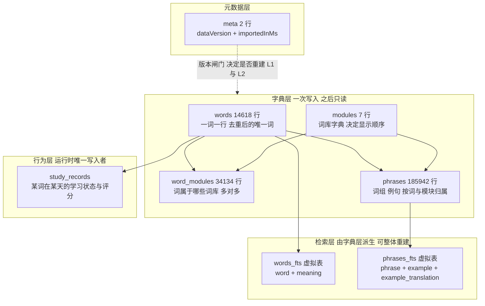
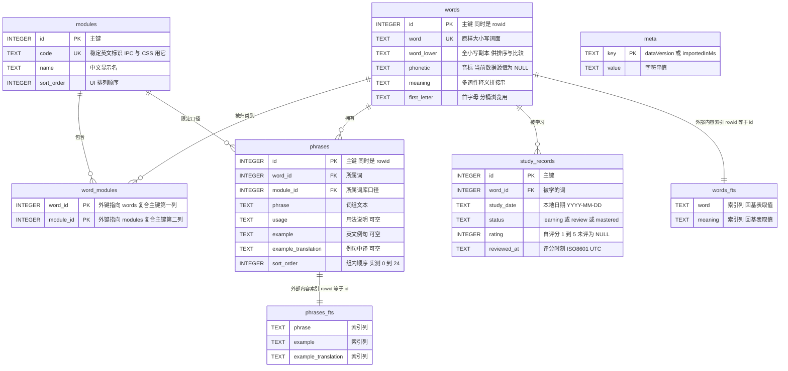
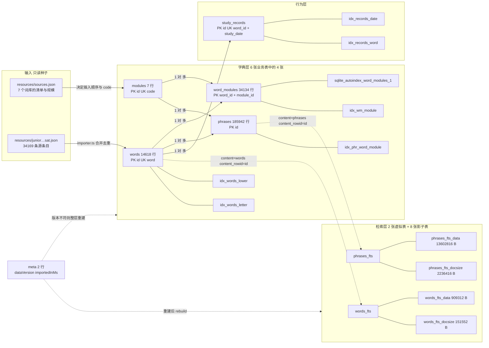
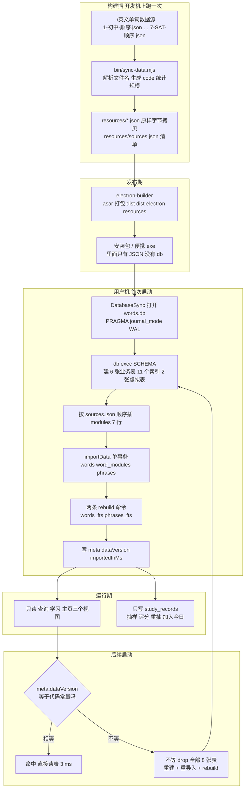
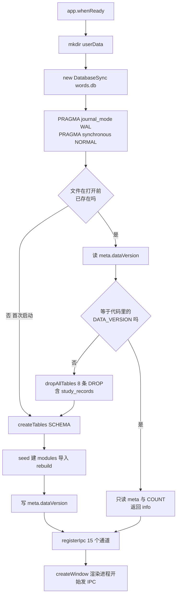
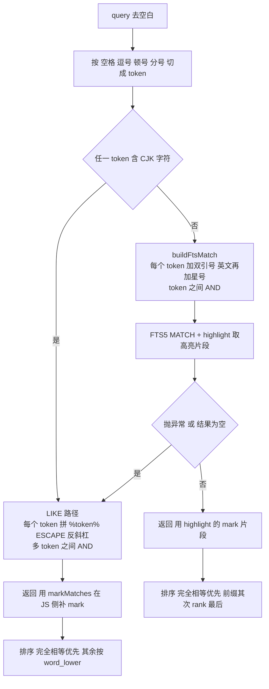
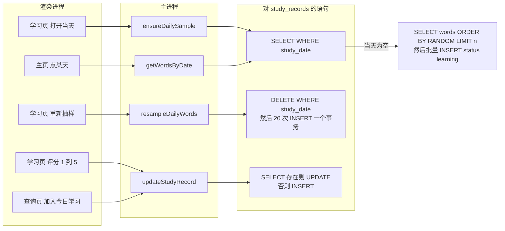

# 数据库表结构与数据流转设计

> 面向：接手这个库的人（改字段、加词库、调检索、排查体积或性能）。
> 口径：本文所有数字都是**实测值**，不是估算。复现命令见 §9，一条命令重新生成全部结构与空间数据。
> 源码真值：`electron/db.ts`（建表）、`electron/importer.ts`（灌数据）、`electron/queries.ts`（读）、`electron/study.ts`（读写学习记录）。

---

## 0. 一分钟结论

| 问题 | 答案 |
| --- | --- |
| 用的是什么库 | SQLite，走 Electron 内置的 `node:sqlite`（`DatabaseSync`），**没有原生依赖、不需要 rebuild** |
| 实测版本 | Node v24.21.0 / SQLite 3.53.4，`pragma_compile_options` 里有 `ENABLE_FTS5` |
| 库文件在哪 | `%APPDATA%\WordStudy\words.db`（单文件，WAL 模式），**不在工程目录、也不在发布包里** |
| 对象总数 | `sqlite_master` 里 16 张表（6 张业务表 + 2 张 FTS5 虚拟表 + 8 张 FTS5 影子表）+ 11 个索引（6 个显式 + 5 个 `sqlite_autoindex_*`）+ 0 触发器 + 0 视图 |
| GUI 里看到的「15 + 2」 | 15 = 6 张业务表 + 8 张影子表 + `sqlite_master` 自己；2 = 两张 FTS5 虚拟表。合计 17 个节点，比 `sqlite_master` 的 16 多出的那一个就是 `sqlite_master`（详见 §3.1） |
| 数据规模（DATA_VERSION 1.1.0） | words 14,618 / word_modules 34,134 / phrases 185,942 / modules 7 / study_records 0（新用户） |
| 库体积 | 50,348,032 字节（48.0 MiB），其中 `phrases` 一张表占 53.1% |
| 谁在写 | **只有 `study_records` 会被运行时写入**；其余 5 张业务表在导入事务里一次写完，之后只读 |
| 检索怎么做 | 英文走 FTS5 前缀匹配，含中文的查询直接走 LIKE 子串，FTS5 零命中或语法不接受时回落 LIKE（§8.5） |
| 最快 / 最慢的读 | 最快 `getWordDetail` 0–1 ms；最慢是词组中文 LIKE，全表扫 185,942 行，37–40 ms（§7.3） |

**关于本文的 7 张 mermaid 图**：本机没有可用的 mermaid 解析器（`node_modules` 里那份 `mermaid@12.1.0` 是 extraneous 包，写本文的会话中途就被移除了，且它不在 `package.json` / `package-lock.json` 里），所以**没有跑过真正的解析器**，只做了静态结构自查：逐块检查括号配平（`[]` `{}` `()`）、双引号成对、竖线边标签成对且紧跟箭头、尖括号只允许 `<br/>`、箭头与 ER 关系符号在白名单内 —— 7 个块全部 0 问题。若在别处渲染报错，优先怀疑标签里的中文标点，而不是图的结构。

---

## 1. 项目概要

### 1.1 应用是什么

一个 Windows 桌面单词学习应用（Electron 44.5.1 + React 19 + Vite 8），单窗口，三个视图：

| 视图 | 干什么 | 对数据库的动作 |
| --- | --- | --- |
| 查询 | 英文/中文全文检索单词与词组，右侧看按模块分组的词组详情 | 只读：`words` `words_fts` `phrases` `phrases_fts` `word_modules` `modules`；点「加入今日学习」时写一行 `study_records` |
| 学习 | 每日随机抽 N 个词做翻卡，自评 1–5 分 | 读写 `study_records`；抽样范围过滤读 `word_modules` |
| 主页 | 热力图、连续天数、当日单词卡片墙 | 只读 `study_records` 聚合 + `words` 关联 |

### 1.2 进程与访问模型（决定了后面所有设计取舍）

```
渲染进程（React）  ──contextBridge──▶  preload  ──ipcRenderer.invoke──▶  主进程
                                                                          │
                                              QueryService / StudyService │ 同步 API
                                                                          ▼
                                                                  node:sqlite DatabaseSync
                                                                          ▼
                                                            %APPDATA%\WordStudy\words.db
```

三条硬约束，直接来自这个模型：

1. **单进程独占**：只有主进程打开数据库，15 个 IPC 通道（`word:ping` … `word:setThemeMode`）是渲染进程唯一的入口。没有并发写、没有连接池、不需要跨进程锁。WAL 在这里的价值不是并发，而是**写入不阻塞读 + 崩溃后自动恢复**。
2. **同步 API**：`DatabaseSync` 是阻塞式的，SQL 跑在主进程主线程上。所以任何查询都必须在几十毫秒内返回，否则整个窗口卡住——这是 §2.3 里「中文查询宁可全表 LIKE 也要压到 40 ms 量级」的原因，也是 §7.3 给每条读路径都附实测延迟的原因。
3. **库不进发布包**：安装包里只有 7 个 JSON 种子（在 `app.asar` 内），`.db` 是**首次启动时在用户机器上现建的**（完整链路见 `doc/Json源文件与数据库文件与打包发布.md`）。所以「schema 版本」必须自带升级闸门，见 §8.3 的 `DATA_VERSION`。

### 1.3 两个数据口径并存（读数字前先看清是哪一版）

| 口径 | DATA_VERSION | modules | words | word_modules | phrases | 库体积 | 现在在哪 |
| --- | --- | --- | --- | --- | --- | --- | --- |
| 旧（4 词库） | 1.0.1 | 4（junior/cet6/kaoyan/sat） | 9,986 | 15,485 | 83,895 | 28,844,032 B（27.5 MiB） | `%APPDATA%\WordStudy\words.db` 现存文件，实测 `importedInMs=832` |
| 新（7 词库） | 1.1.0 | 7（+senior/cet4/toefl） | 14,618 | 34,134 | 185,942 | 50,348,032 B（48.0 MiB） | 当前代码 + `resources/` 种子；现存库下次启动会重建成这一版 |

实测两版的 **DDL 逐字相同**（对两份库的 `sqlite_master.sql` 做 JSON 序列化比对，结果 `true`）：1.0.1 → 1.1.0 是**数据口径升级，不是 schema 升级**。本文其余部分的数字除特别标注外都是 1.1.0 的新建库实测值。

---

## 2. 项目数据库选型

### 2.1 为什么是 SQLite，而且是 Electron 内置的那一个

| 候选 | 判据 | 结论 |
| --- | --- | --- |
| `node:sqlite`（Electron 内置） | 零安装、零编译、FTS5 已编译进去 | ✅ **采用**。实测 Electron 44.5.1 内嵌 Node 24.21.0 / SQLite 3.53.4，`pragma_compile_options` 含 `ENABLE_FTS5` |
| `better-sqlite3` | 需要 `electron-rebuild` 或预编译包，联网下载 | ❌ 本机实测 GitHub HEAD 能通但 GET 下载 `connect ETIMEDOUT`，装不上就等于工程不能复现 |
| `sql.js`（wasm） | 库在内存里，要自己落盘 | ❌ 48 MiB 全量进内存 + 手动持久化，白付代价 |
| 服务端数据库 | 需要网络与部署 | ❌ 桌面单机应用，离线是需求不是妥协 |

选 `node:sqlite` 换来的一条实际收益，写在 `doc/运行与构建（T0Level）.md` 里：**没有原生依赖 → 不需要 rebuild → 打包期不会去下载预编译包**，这条链路上所有超时/镜像问题一次性消失。

### 2.2 连接级 PRAGMA（每次打开都执行，不落盘的除外）

`electron/db.ts` 打开库后立刻执行：

```sql
PRAGMA journal_mode = WAL;
PRAGMA synchronous = NORMAL;
```

| PRAGMA | 实测值（新建库） | 是否落盘 | 说明 |
| --- | --- | --- | --- |
| `journal_mode` | `wal` | ✅ 写进文件头 | 只读工具打开也是 `wal`。干净退出时 WAL 被 checkpoint 并删除——实测关闭后 `-wal` / `-shm` 文件都不存在 |
| `synchronous` | `1`（NORMAL） | ❌ 连接级 | **取证陷阱**：用别的工具只读打开会看到 `2`（FULL），那是工具没设，不是库变了 |
| `foreign_keys` | `1` | ❌ 连接级 | 代码从没执行过这条 PRAGMA，但实测新建连接默认就是 `1`（Node 24.21.0）。别按 sqlite3 CLI 的「默认 OFF」经验推断，见 §6.4 |
| `page_size` | 4096 | ✅ | 12,292 页 × 4096 = 50,348,032 字节 = 文件大小，逐字节对上 |
| `encoding` | UTF-8 | ✅ | 中文释义/例句直接存 UTF-8，没有转码层 |
| `integrity_check` | `ok` | — | 新建库与现存 1.0.1 库都是 `ok` |
| `auto_vacuum` | `0`（NONE） | ✅ | 见 §6.6 关于 `freelist_count` 的说明 |

### 2.3 全文检索：FTS5 + `unicode61`，中文另走 LIKE

设计方案原本要 `simple` 分词器（能切中文词）。实测不可用：

- `db.loadExtension()` 在 Electron 里抛 `extension loading is not allowed`（Electron 禁载扩展，见 `doc/运行与构建（T0Level）.md`）。
- 所以两张虚拟表都用 `tokenize='unicode61'`：英文按词切、能做前缀匹配；**中文只按标点与空白切**，一整串汉字会被当成一个 token。

实测证据（同一份 1.1.0 库，`words.meaning` 上比对）：

| 查询 | FTS5 `MATCH` 命中 | LIKE 命中 | 结论 |
| --- | --- | --- | --- |
| `"ab"*`（英文前缀） | 110 | — | FTS5 前缀匹配正常工作 |
| `"abandon"`（英文整词） | 1 | — | 精确命中 |
| `"放弃"`（中文双字） | 16 | 23 | FTS5 只能命中「放弃」正好被标点切出来的那些行，**少 7 条** |
| `"弃"`（中文单字） | **0** | 44 | 单字彻底搜不到 |

于是检索口径定死为：**含中文 → 直接 LIKE；纯英文 → FTS5 前缀；FTS5 抛错或零命中 → 回落 LIKE**（判定代码在 `queries.ts` 的 `CJK` 正则与 `useLike` 分支）。代价是全表扫，但实测可接受：`words` 14,618 行 LIKE 4–5 ms，`phrases` 185,942 行三列 LIKE 37–40 ms，都远在 500 ms 门槛内。

### 2.4 外部内容表（`content=`）：省一半空间，换来一条必须记住的约束

两张 FTS5 表都声明了 `content='words'` / `content='phrases'` + `content_rowid='id'`，即**索引不复制原文**，取列值时回基表读。收益实测：

| | 基表 | FTS 索引 | 索引/基表 |
| --- | --- | --- | --- |
| words | 1,101,824 B | `words_fts_data` 909,312 B | 0.83× |
| phrases | 26,738,688 B | `phrases_fts_data` 13,602,816 B | 0.51× |

代价：**基表改了，索引不会跟着改**（库里 `triggers = 0`，没有任何同步触发器）。受控实验（在临时库上做的，用户库未受影响）：

```sql
DELETE FROM words WHERE id = 1;                                  -- 'ability'
SELECT COUNT(*) FROM words_fts WHERE words_fts MATCH '"ability"'; -- 仍然返回 1（索引还留着）
SELECT word FROM words_fts WHERE words_fts MATCH '"ability"';     -- 抛错：
-- fts5: missing row 1 from content table 'main'.'words'
SELECT COUNT(*) FROM words_fts;                                   -- 14617（跟着基表变了！）
SELECT COUNT(*) FROM words_fts_docsize;                           -- 14618（这个才是索引的真实行数）
INSERT INTO words_fts(words_fts) VALUES('rebuild');               -- 修复
-- 之后 MATCH 命中 0，docsize 14617，PRAGMA integrity_check = ok
```

两个必须记住的结论：

1. **`COUNT(*) FROM <fts表>` 不能用来判断索引是否同步**——外部内容表的行数与 rowid 是回基表读的，删除后它立刻「看起来对」。要查同步状态得看 `*_docsize` 或直接 `MATCH` 一个已删的词。
2. 本项目**不需要**同步触发器：5 张字典表导入后只读，唯一的写法是「改数据口径 → bump `DATA_VERSION` → 全量 drop + 重建 + rebuild」，一条 `rebuild` 命令解决，比维护 4 个触发器便宜。但如果将来做「用户自定义词库/删词」，就必须补触发器或每次写后 rebuild。

### 2.5 不放进数据库的东西

| 数据 | 存哪 | 为什么不在库里 |
| --- | --- | --- |
| 主题模式、窗口几何 | `%APPDATA%\WordStudy\settings.json` | 建窗早于建库；且这类配置需要「库坏了也还在」 |
| 词库清单与规模 | `resources/sources.json`（随包发布） | 是**输入**不是**状态**；导入按它的 `files` 列表走 |
| 词典原文 | `resources/*.json`（随包发布） | 库是它们的派生物，随时可重建 |

`meta` 表因此只有 2 行：`dataVersion` 与 `importedInMs`。

---

## 3. 表结构清单与设计目的

### 3.1 「15 + 2」是怎么数出来的

数据库 GUI 里看到的 17 个节点，与 `sqlite_master` 的 16 行不矛盾，差的一个是 `sqlite_master` 自己（它不出现在自己的结果集里，但 GUI 会列出来；dbstat 里它的名字是 `sqlite_schema`，`sqlite_master` 是历史别名）。

| 分类 | 数量 | 成员 |
| --- | --- | --- |
| 业务表（本文重点） | 6 | `words` `modules` `word_modules` `phrases` `study_records` `meta` |
| FTS5 虚拟表 | 2 | `words_fts` `phrases_fts` |
| FTS5 影子表（引擎私有，勿碰） | 8 | `words_fts_config/_data/_docsize/_idx`、`phrases_fts_config/_data/_docsize/_idx` |
| 系统表 | 1 | `sqlite_master`（= `sqlite_schema`） |
| 索引 | 11 | 显式 6：`idx_words_lower` `idx_words_letter` `idx_wm_module` `idx_phr_word_module` `idx_records_date` `idx_records_word`；自动 5：`sqlite_autoindex_{words,modules,word_modules,study_records,meta}_1` |
| 触发器 / 视图 | 0 / 0 | 实测 `sqlite_master` 里没有 `type='trigger'` 或 `'view'` 的行 |

影子表的职责（FTS5 内部结构，只列出便于看懂体积）：`_data` 存倒排索引段、`_docsize` 每篇文档一行存字段长度（`rank` 排序要用）、`_idx` 存段合并的中间状态、`_config` 存格式版本（实测两张表都是 `version=4`）。

### 3.2 对象清单（含实测行数与磁盘占用）

体积来自 `dbstat` 虚拟表（本机可用），按占用降序。文件总大小 50,348,032 B = dbstat 合计 49,459,200 B + 空闲页 217 × 4096 B = 888,832 B，**逐项对得上**。

| # | 对象 | 类型 | 行数 | 字节 | 页 | 占文件 | 职责一句话 |
| --- | --- | --- | --- | --- | --- | --- | --- |
| 1 | `phrases` | 业务表 | 185,942 | 26,738,688 | 6,528 | 53.1% | 词组 + 用法 + 例句 + 例句译文，按（词, 模块）归属 |
| 2 | `phrases_fts_data` | 影子表 | — | 13,602,816 | 3,321 | 27.0% | 词组倒排索引主体 |
| 3 | `idx_phr_word_module` | 索引 | — | 2,723,840 | 665 | 5.4% | 详情页「按词取词组」的主通道 |
| 4 | `phrases_fts_docsize` | 影子表 | 185,942 | 2,236,416 | 546 | 4.4% | 每篇文档的字段长度，`rank` 用 |
| 5 | `words` | 业务表 | 14,618 | 1,101,824 | 269 | 2.2% | 词典主表，一词一行 |
| 6 | `words_fts_data` | 影子表 | — | 909,312 | 222 | 1.8% | 单词倒排索引主体 |
| 7 | `sqlite_autoindex_word_modules_1` | 自动索引 | — | 471,040 | 115 | 0.9% | 复合主键 (word_id, module_id) 的物化，兼作「按词查模块」的覆盖索引 |
| 8 | `word_modules` | 业务表 | 34,134 | 397,312 | 97 | 0.8% | 词 ↔ 词库多对多关系 |
| 9 | `idx_wm_module` | 索引 | — | 348,160 | 85 | 0.7% | 反向：按模块列出词 |
| 10 | `idx_words_lower` | 索引 | — | 258,048 | 63 | 0.5% | 大小写不敏感排序/前缀比较 |
| 11 | `sqlite_autoindex_words_1` | 自动索引 | — | 253,952 | 62 | 0.5% | `words.word UNIQUE` 的物化，导入期防重 |
| 12 | `words_fts_docsize` | 影子表 | 14,618 | 151,552 | 37 | 0.3% | 同上（words 侧） |
| 13 | `idx_words_letter` | 索引 | — | 151,552 | 37 | 0.3% | 首字母分桶浏览 |
| 14 | `phrases_fts_idx` | 影子表 | — | 65,536 | 16 | 0.1% | 段合并中间状态 |
| 15–26 | 其余 12 个对象：`words_fts_idx` `words_fts_config` `phrases_fts_config` `study_records` `sqlite_schema` `modules` `meta` `idx_records_date` `idx_records_word` + `sqlite_autoindex_{study_records,modules,meta}_1` | 表/索引/影子表 | — | 各 4,096 | 各 1 | 各 0.008% | 空表与极小表都只占 1 页 |

> `study_records` 只有 1 页（4,096 B）是因为新建库还没有学习记录；它是唯一会随使用增长的表，增长模型见 §6.5。

### 3.3 分层与设计目的



四层的取舍逻辑：

- **字典层规范化到 3NF**：词、词库、关系、词组分四张表，一个词跨 7 个词库也只存一行释义（实测 7,808 个词跨模块重复，直方图见 §6.1）。
- **检索层是纯派生物**：可以随时 `DROP` + `rebuild` 而不丢任何信息，所以敢用外部内容表省空间（§2.4）。
- **行为层与字典层解耦**：`study_records` 只存 `word_id`，不复制词面，词面改了学习记录照样对得上。
- **元数据层是升级闸门**：只有 2 行，但决定了「启动时要不要重建整个字典层」（§8.3）。

---

## 4. 表结构描述（描述 + 完整 DDL）

以下 DDL 逐字引自 `electron/db.ts` 的 `SCHEMA` 常量（建库时 `db.exec(SCHEMA)` 一次执行）。已实测：新建的 1.1.0 库与现存的 1.0.1 库，其 `sqlite_master.sql` 完全一致。

### 4.1 `words` — 词典主表

**描述**：去重后的唯一单词，一词一行。是整个库的中心表：其他 4 张业务表都通过 `word_id` 指向它，两张 FTS5 虚拟表以它的 `id` 作 `content_rowid`。`word` 保留数据源原样大小写（用于显示），`word_lower` 是全小写副本（用于大小写不敏感的排序与精确比较），`first_letter` 是首字母分桶键。`phonetic` 字段留了位置但当前数据源没有音标，**14,618 行全为 NULL**（实测）。`meaning` 是把数据源里同一词的多条 `translations` 拼成的单串。

```sql
CREATE TABLE words (
  id INTEGER PRIMARY KEY,
  word TEXT NOT NULL UNIQUE,
  word_lower TEXT NOT NULL,
  phonetic TEXT,
  meaning TEXT NOT NULL,
  first_letter TEXT NOT NULL
);
CREATE INDEX idx_words_lower ON words(word_lower);
CREATE INDEX idx_words_letter ON words(first_letter);
```

实测样例（`id = 1987`）：

| 字段 | 值 |
| --- | --- |
| `word` | `abandon` |
| `word_lower` | `abandon` |
| `phonetic` | `NULL` |
| `meaning` | `n 放任；狂热；v 遗弃；放弃；vt 放弃` |
| `first_letter` | `a` |
| 关联模块数 | 6（senior / cet4 / cet6 / kaoyan / toefl / sat） |

### 4.2 `modules` — 词库字典

**描述**：7 个词库（初中/高中/CET4/CET6/考研/托福/SAT），一行一个。`code` 是稳定英文标识（IPC 参数、CSS 的 `data-module`、`resources/sources.json` 都用它），`name` 是中文显示名，`sort_order` 决定 UI 上的排列顺序。7 行数据在导入前由 `sources.json` 的 `files` 顺序写入（`sort_order = 下标 + 1`）。

```sql
CREATE TABLE modules (
  id INTEGER PRIMARY KEY,
  code TEXT NOT NULL UNIQUE,
  name TEXT NOT NULL,
  sort_order INTEGER DEFAULT 0
);
```

实测全表：

| id | code | name | sort_order | 词数 | 词组数 |
| --- | --- | --- | --- | --- | --- |
| 1 | junior | 初中 | 1 | 1,986 | 10,012 |
| 2 | senior | 高中 | 2 | 3,742 | 25,371 |
| 3 | cet4 | CET4 | 3 | 4,543 | 22,714 |
| 4 | cet6 | CET6 | 4 | 3,991 | 19,960 |
| 5 | kaoyan | 考研 | 5 | 5,046 | 25,280 |
| 6 | toefl | 托福 | 6 | 10,367 | 53,979 |
| 7 | sat | SAT | 7 | 4,459 | 28,626 |
| | | | 合计 | **34,134** | **185,942** |

（「词数」列合计 = `word_modules` 行数，「词组数」列合计 = `phrases` 行数，两条恒等式都对得上。）

### 4.3 `word_modules` — 词 ↔ 词库 多对多关系

**描述**：纯关系表，只有两列，复合主键即唯一约束。一个词可以同时属于多个词库（实测 7,808 个词属于 2 个以上词库，26 个词 7 个词库全占）。**没有代理主键 `id`**：这张表的每一行就是「这个关系存在」这一事实，天然不需要身份；复合主键顺带当覆盖索引用（`EXPLAIN QUERY PLAN` 里显示为 `SEARCH wm USING COVERING INDEX sqlite_autoindex_word_modules_1 (word_id=? AND module_id=?)`）。

```sql
CREATE TABLE word_modules (
  word_id INTEGER NOT NULL,
  module_id INTEGER NOT NULL,
  PRIMARY KEY (word_id, module_id),
  FOREIGN KEY (word_id) REFERENCES words(id) ON DELETE CASCADE,
  FOREIGN KEY (module_id) REFERENCES modules(id) ON DELETE CASCADE
);
CREATE INDEX idx_wm_module ON word_modules(module_id);
```

`idx_wm_module` 是为**反向查询**建的：`word_id` 打头的主键能回答「这个词属于哪些词库」，但回答不了「CET6 里有哪些词」，后者要靠 `module_id` 打头的这个索引。

### 4.4 `phrases` — 词组 / 用法 / 例句

**描述**：库里最大的表（占 53.1% 空间）。一行 = 某个词在某个词库口径下的一条词组，携带用法说明、英文例句、例句中文译文。**同时挂 `word_id` 与 `module_id`** 是关键设计：同一个词在不同词库里的词组集合不同（数据源就是按词库分别给的），UI 的详情页要「按模块分组展示」，所以词组必须知道自己属于哪个模块，不能只挂在词上。例句没有独立表——数据源里例句就内嵌在 `phrases[]` 里，一条词组最多一组例句，拆表只会多一次 JOIN。

```sql
CREATE TABLE phrases (
  id INTEGER PRIMARY KEY,
  word_id INTEGER NOT NULL,
  module_id INTEGER NOT NULL,
  phrase TEXT NOT NULL,
  usage TEXT,
  example TEXT,
  example_translation TEXT,
  sort_order INTEGER DEFAULT 0,
  FOREIGN KEY (word_id) REFERENCES words(id) ON DELETE CASCADE,
  FOREIGN KEY (module_id) REFERENCES modules(id) ON DELETE CASCADE
);
CREATE INDEX idx_phr_word_module ON phrases(word_id, module_id);
```

实测样例（`abandon` 在高中模块下的前 4 条）：

| id | module_id | phrase | usage | example | example_translation | sort_order |
| --- | --- | --- | --- | --- | --- | --- |
| 45,795 | 2 | abandon oneself to | 表示沉溺于、放纵于某种情绪 | He abandoned himself to despair. | 他陷入了绝望。 | 0 |
| 45,796 | 2 | with abandon | 表示尽情地、放纵地 | She danced with abandon. | 她尽情地跳舞。 | 1 |
| 45,797 | 2 | abandon ship | 表示弃船 | The captain ordered the crew to abandon ship. | 船长下令船员弃船。 | 2 |
| 45,798 | 2 | abandon one's post | 表示擅离职守 | He was dismissed for abandoning his post. | 他因擅离职守被解雇。 | 3 |

### 4.5 `study_records` — 学习行为记录

**描述**：运行时**唯一**被写入的业务表。一行 = 某个词在某个自然日的学习状态。`UNIQUE (word_id, study_date)` 是「每日抽样幂等」的地基：同一天重复调用抽样不会产生第二批词。`status` 由评分派生（`rating >= 3` → `mastered`，否则 `review`；刚抽出来还没评分 → `learning`）。两个日期字段格式不同，理由见 §5.5。

```sql
CREATE TABLE study_records (
  id INTEGER PRIMARY KEY,
  word_id INTEGER NOT NULL,
  study_date TEXT NOT NULL,
  status TEXT NOT NULL DEFAULT 'learning',
  rating INTEGER,
  reviewed_at TEXT,
  UNIQUE (word_id, study_date),
  FOREIGN KEY (word_id) REFERENCES words(id) ON DELETE CASCADE
);
CREATE INDEX idx_records_date ON study_records(study_date);
CREATE INDEX idx_records_word ON study_records(word_id);
```

两个索引各自服务一类聚合（实测执行计划）：`idx_records_date` → 热力图 `SEARCH ... USING COVERING INDEX idx_records_date (study_date>?)`、连续天数 `SCAN ... USING COVERING INDEX idx_records_date`；`idx_records_word` → 累计学习词数 `SCAN ... USING COVERING INDEX idx_records_word`（`COUNT(DISTINCT word_id)` 直接由索引满足，不回表）。

### 4.6 `meta` — 键值元数据

**描述**：两行的键值表，承载「这个库是哪一版数据」和「导入花了多久」。前者是升级闸门的判据，后者只是给 UI 上的「数据库信息」看。用键值表而不是加列/加表，是为了将来加元数据时不用改 schema。

```sql
CREATE TABLE meta (
  key TEXT PRIMARY KEY,
  value TEXT
);
```

实测内容：`dataVersion = 1.1.0`、`importedInMs = 1640`。

### 4.7 `words_fts` / `phrases_fts` — FTS5 虚拟表

**描述**：两张外部内容（external content）全文索引表。`content=` 指向基表、`content_rowid='id'` 让 FTS 的 rowid 与基表主键**同一个数**——这是执行计划里 `SEARCH w USING INTEGER PRIMARY KEY (rowid=?)` 能一步命中的原因，不需要额外 JOIN 键。`words_fts` 索引 `word` 与 `meaning` 两列（所以英文能同时搜词面和释义），`phrases_fts` 索引 `phrase` `example` `example_translation` 三列（所以能按例句中文搜词组）。

```sql
CREATE VIRTUAL TABLE words_fts USING fts5(
  word, meaning,
  content='words',
  content_rowid='id',
  tokenize='unicode61'
);

CREATE VIRTUAL TABLE phrases_fts USING fts5(
  phrase, example, example_translation,
  content='phrases',
  content_rowid='id',
  tokenize='unicode61'
);
```

实测：`PRAGMA table_info(words_fts)` 只返回 `word` `meaning` 两列（FTS5 的 `rowid` `rank` 及命令列是隐藏列，不出现在 `table_info` 里）；行数与基表严格相等（14,618 / 185,942）；`highlight()` 能取回原文并插 `<mark>`，因为原文是回基表读的。

### 4.8 完整 SCHEMA 与 DROP 顺序

`electron/db.ts` 里还有一段与 `SCHEMA` 配对的 `DROP`，重建时按这个顺序执行（先影子/虚拟表，再子表，再父表）：

```sql
DROP TABLE IF EXISTS phrases_fts;
DROP TABLE IF EXISTS words_fts;
DROP TABLE IF EXISTS study_records;   -- 注意：升级会连带清掉学习记录，见 §10
DROP TABLE IF EXISTS phrases;
DROP TABLE IF EXISTS word_modules;
DROP TABLE IF EXISTS modules;
DROP TABLE IF EXISTS meta;
DROP TABLE IF EXISTS words;
```

### 4.9 关系总览（mermaid ER 图）



---

## 5. 表字段作用详解

「来源」列指数据从哪来：`JSON:` 前缀 = 直接取自 `resources/*.json` 的字段；`计算:` = 导入器算出来的；`运行时:` = 应用运行中产生。

### 5.1 `words`

| 字段 | 类型/约束 | 来源 | 谁写 | 谁读 | 作用与设计理由 |
| --- | --- | --- | --- | --- | --- |
| `id` | INTEGER PK | SQLite 自增（rowid 别名） | 导入事务 | 所有表的外键、FTS 的 `content_rowid` | 稳定代理键。数据源没有 ID，必须自己发一个；选 rowid 别名而不是 `AUTOINCREMENT`，省掉 `sqlite_sequence` 表和一次查询 |
| `word` | TEXT NOT NULL UNIQUE | `JSON:word`（`trim()` 后原样） | 导入事务 | 显示、精确匹配、UNIQUE 去重 | 保留原始大小写用于显示（`May` 与 `may` 在数据源里是两条）。UNIQUE 是导入期的最后一道防线，实测物化成 `sqlite_autoindex_words_1`（253,952 B） |
| `word_lower` | TEXT NOT NULL | 计算：`word.toLowerCase()` | 导入事务 | 排序、前缀比较 | **故意的冗余**。SQLite 的 `ORDER BY`/`LIKE` 默认区分大小写，若不加这列就得每次 `ORDER BY LOWER(word)`——那会对 14,618 行逐行调用函数且用不上索引。存一列换 `idx_words_lower`（258,048 B）可走索引排序 |
| `phonetic` | TEXT NULL | 无（数据源没有音标字段） | 从不写 | UI 有则显示 | **14,618 行全 NULL**（实测）。留着是因为音标是词典类应用的常规字段，将来换数据源不必改 schema；`resources/sources.json` 的 `notes` 里也记了这条 |
| `meaning` | TEXT NOT NULL | `JSON:translations[]` 拼接 | 导入事务 | 显示、中文 LIKE 检索、FTS 索引列 | 拼接规则：每条 `translation` 若有 `type` 就写成 `type + 空格 + translation`，多条之间用全角 `；` 连接。实测 14,610 / 14,618 行的 `meaning` 含空格（即带 `type` 前缀的形态），9,217 行含 `；`（多词性），最长 126 字符。例：`slip` → `v 滑动；滑倒；犯错；…；n 滑，滑倒；…；adj 滑动的；…` |
| `first_letter` | TEXT NOT NULL | 计算：`word_lower[0]` | 导入事务 | 首字母浏览、抽样过滤 | 又是一处**故意冗余**：让「按字母浏览」走 `idx_words_letter` 而不是 `WHERE word_lower LIKE 'a%'`。实测 26 个不同值（a–z），执行计划 `SEARCH w USING INDEX idx_words_letter (first_letter=?)` |

`NOT NULL` 但没有 `DEFAULT` 的三列（`word_lower` `meaning` `first_letter`）都由导入器保证：实测 `meaning = ''` 的行数为 0，`first_letter = ''` 的行数为 0。

### 5.2 `modules`

| 字段 | 类型/约束 | 来源 | 谁写 | 谁读 | 作用与设计理由 |
| --- | --- | --- | --- | --- | --- |
| `id` | INTEGER PK | 自增 | 建库时按 `sources.json` 顺序插入 | `word_modules.module_id`、`phrases.module_id` | 只有 7 行，但所有关系都指向它 |
| `code` | TEXT NOT NULL UNIQUE | `sources.json:files[].code` | 同上 | IPC 入参（`SearchOptions.modules`、`SampleOptions.modules`）、CSS `data-module`、前端筛选 chips | **跨层稳定标识**。UI 传的是 `code` 而不是 `id`，所以 SQL 里到处是 `JOIN modules m ON … WHERE m.code IN (…)`；这样即使重建后 `id` 变了，前端与样式表都不用改 |
| `name` | TEXT NOT NULL | `sources.json:files[].name`（中文名，由 `bin/sync-data.mjs` 从原始文件名 `1-初中-顺序.json` 解析） | 同上 | 界面显示（chips、副标题、详情分组标题） | 显示名与标识分离，改名不影响数据 |
| `sort_order` | INTEGER DEFAULT 0 | 计算：`sources.json` 里的下标 + 1 | 同上 | `ORDER BY sort_order`（模块列表、详情页分组） | 让「初中 → 高中 → CET4 → …」这个教学顺序由数据决定，不写死在 UI 里 |

### 5.3 `word_modules`

| 字段 | 类型/约束 | 来源 | 谁写 | 谁读 | 作用与设计理由 |
| --- | --- | --- | --- | --- | --- |
| `word_id` | INTEGER NOT NULL, PK(1), FK→words ON DELETE CASCADE | 计算：导入时拿 `words.id` | 导入事务 | 「词属于哪些词库」、模块过滤子查询 | 复合主键第一列，天然形成 `word_id` 打头的覆盖索引 |
| `module_id` | INTEGER NOT NULL, PK(2), FK→modules ON DELETE CASCADE | 计算：`code` → `id` 查表 | 导入事务 | 「词库里有哪些词」、chips 计数 | 反向查询由 `idx_wm_module` 服务 |

这张表没有第三个字段，也没有 `id`：它存的不是实体，是一个事实（fact）。实测 34,134 行 = 各模块词数之和，与「每个词属于几个模块」的直方图完全一致（§6.1）。

### 5.4 `phrases`

| 字段 | 类型/约束 | 来源 | 谁写 | 谁读 | 作用与设计理由 |
| --- | --- | --- | --- | --- | --- |
| `id` | INTEGER PK | 自增 | 导入事务 | `phrases_fts.content_rowid`、前端列表 key | 词组需要独立身份，因为 FTS 的 rowid 要指向它 |
| `word_id` | INTEGER NOT NULL, FK→words CASCADE | 计算 | 导入事务 | 详情页「按词取全部词组」 | 与 `module_id` 一起被 `idx_phr_word_module` 覆盖 |
| `module_id` | INTEGER NOT NULL, FK→modules CASCADE | 计算 | 导入事务 | 详情页按模块分组、词组检索的模块过滤 | **本表最关键的设计**：词组是「某词库口径下的词组」，不是「某词的词组」。理由与反例见 §6.2 |
| `phrase` | TEXT NOT NULL | `JSON:phrases[].phrase`（`trim()`） | 导入事务 | 显示、FTS 索引列、LIKE 列 | 非空是硬约束：导入器遇到空文本直接跳过（`(p.phrase ?? '').trim()` 为空则 `continue`），所以库里没有空词组 |
| `usage` | TEXT NULL | `JSON:phrases[].usage`，空串归一为 NULL | 导入事务 | 详情页显示 | 实测 11,577 行为 NULL（senior 803 + toefl 10,774），其余 174,365 行有值。**空串统一转 NULL** 是为了让「有没有」只有一个判据（`IS NULL`），不必同时判空串 |
| `example` | TEXT NULL | `JSON:phrases[].example`，同上 | 导入事务 | 显示、FTS 索引列、LIKE 列 | NULL 分布与 `usage` 完全相同（11,577）：数据源里这三个字段是同时缺失的 |
| `example_translation` | TEXT NULL | `JSON:phrases[].example_translation`，同上 | 导入事务 | 显示、FTS 索引列、LIKE 列 | 同上 |
| `sort_order` | INTEGER DEFAULT 0 | 计算：该 (词, 模块) 组内的下标 | 导入事务 | `ORDER BY module_id, sort_order` | **保住数据源的原始顺序**（教材/词频顺序是有信息量的）。实测范围 0–24，即单个 (词, 模块) 最多 25 条词组，平均 5.45 条 |

### 5.5 `study_records`

| 字段 | 类型/约束 | 来源 | 谁写 | 谁读 | 作用与设计理由 |
| --- | --- | --- | --- | --- | --- |
| `id` | INTEGER PK | 自增 | 抽样/评分 | 排序（`getWordsByDate` 用 `ORDER BY id` 保证当天卡片顺序稳定） | 抽样顺序 = 展示顺序，靠自增 id 免费拿到 |
| `word_id` | INTEGER NOT NULL, FK→words CASCADE | 计算：`ORDER BY RANDOM()` 抽出来的 `words.id` | 抽样 | 关联词面与词组、去重统计 | 只存 id 不存词面：字典重建后（同 `DATA_VERSION`）关系仍然成立 |
| `study_date` | TEXT NOT NULL | 运行时：`todayLocalDate()` 生成的**本地**日期 `YYYY-MM-DD` | 抽样/评分 | 热力图分组、连续天数、当日查询 | 用 TEXT 而不是 INTEGER 时间戳：① `GROUP BY study_date` 直接出热力图的横轴；② `WHERE study_date >= ?` 与 `substr(study_date,1,7) = ?`（本月）都是字符串运算，可读且能走 `idx_records_date`；③ 定宽 ISO 格式的字典序 = 时间序，排序无需转换 |
| `status` | TEXT NOT NULL DEFAULT 'learning' | 计算：`rating >= 3 ? 'mastered' : 'review'`；刚抽出来是 `'learning'` | 抽样/评分 | 热力图的 mastered 数、统计卡片 | 三态字符串而不是布尔：热力图要同时显示「学过」和「掌握」两个量。实测一次评分后分布：rating 4 → `mastered`，rating 1 → `review`，未评的 18 条 → `learning` |
| `rating` | INTEGER NULL | 运行时：UI 自评 1–5 | 评分 | 统计 | NULL = 还没评。没有 CHECK 约束，取值范围由 UI 的 5 个按钮保证 |
| `reviewed_at` | TEXT NULL | 运行时：`new Date().toISOString()`（**UTC**） | 评分 | 目前只在调试时看 | 与 `study_date` 的口径不同（UTC vs 本地），是有意的：`study_date` 是「哪一天学的」这个业务概念，必须按用户本地日历；`reviewed_at` 是「几点几分评的」这个瞬时戳，用 UTC 无歧义。**但注意 §10.1 记录的一处口径混用** |
| `UNIQUE (word_id, study_date)` | 表级唯一约束 | — | — | — | 幂等抽样的地基。实测重复插入同一 (词, 日) 抛 `UNIQUE constraint failed: study_records.word_id, study_records.study_date`；换一个当天没有的 `word_id` 就能插入（对照实验，证明报错确实来自这条约束） |

### 5.6 `meta`

| 字段 | 类型/约束 | 来源 | 谁写 | 谁读 | 作用 |
| --- | --- | --- | --- | --- | --- |
| `key` | TEXT PK | 代码里的字面量 | `writeMeta()` | `readMeta()` | 实测只有 `dataVersion`、`importedInMs` 两个键 |
| `value` | TEXT NULL | 同上 | 同上 | 同上 | 全部存字符串；`importedInMs` 读出来后 `Number()` 转数字 |

`writeMeta()` 是「先 SELECT 判断存在，再 UPDATE 或 INSERT」，不是 `UPSERT`——7 行的表上没有任何性能差别，换来的是不依赖 SQLite 版本特性。

---

## 6. 表的设计目的（为什么是这个形状）

### 6.1 `words` 与 `word_modules` 拆开：因为一个词平均属于 2.3 个词库

如果把「所属词库」做成 `words` 上的一个逗号串或 JSON 列，会立刻失去：按词库过滤的索引、`ON DELETE CASCADE` 的一致性、以及「某词库有多少词」的一条 `COUNT`。实测的重复度证明这个拆分是必要的：

| 属于几个词库 | 词数 | 占比 |
| --- | --- | --- |
| 1 | 6,810 | 46.6% |
| 2 | 2,235 | 15.3% |
| 3 | 1,708 | 11.7% |
| 4 | 2,022 | 13.8% |
| 5 | 1,442 | 9.9% |
| 6 | 375 | 2.6% |
| 7 | 26 | 0.2% |
| 合计 | **14,618** | 100% |

两条恒等式（都可复现，见 §9）：

- 词数合计 = `COUNT(words)` = 14,618 = `resources/sources.json` 的 `totals.uniqueWords`
- `Σ(属于 n 个词库的词数 × n)` = 6,810 + 4,470 + 5,124 + 8,088 + 7,210 + 2,250 + 182 = **34,134** = `COUNT(word_modules)` = 各模块词数之和

也就是说：34,169 条源条目 − 35 条同文件内重复词 = 34,134 条 (词, 词库) 关系，再去重到 14,618 个唯一词，7,808 个词跨库复用。若不拆表，`abandon` 的释义要复制 6 份。

### 6.2 `phrases` 为什么必须带 `module_id`

同一个词在不同词库下的词组集合**不一样**（数据源是按词库分别整理的，高中给的搭配和托福给的搭配侧重不同）。两种候选设计：

| 方案 | 结果 |
| --- | --- |
| ❌ 只挂 `word_id`，词组去重合并 | 详情页无法回答「这条词组是高中要求还是托福要求」，UI 的按模块分组直接做不出来；且合并会丢掉「同一词组在不同模块下的不同例句」 |
| ✅ 挂 `(word_id, module_id)`，同一词组文本在不同模块各存一行 | 详情页一条 SQL 拿到分组数据（`WHERE word_id = ? ORDER BY module_id, sort_order`，实测走 `idx_phr_word_module`，0–1 ms） |

代价是空间：这是 `phrases` 长到 185,942 行、占库 53.1% 的直接原因（源数据 190,926 条词组，导入器只在**同一 (词, 模块) 内**去掉文本完全相同的重复，实测去掉 4,984 条）。这是明确的「用空间换查询形状」的取舍。

导入器的去重口径值得单独记住（`importer.ts`）：同一文件里同一个词可能出现两次（例如 junior 的 `May` / `may`），这时词组是**追加**而不是覆盖；只有 (词, 模块) 内词组文本完全一致才算重复丢掉。首版实现是覆盖，实测少收 75 条词组，因此有了 `DATA_VERSION 1.0.1`。

### 6.3 三处「故意冗余」及其收益

| 冗余 | 换来的东西 | 实测证据 |
| --- | --- | --- |
| `words.word_lower` | 大小写不敏感排序可走索引 | `ORDER BY (w.word_lower = ?) DESC, w.word_lower` + `idx_words_lower`；中文 LIKE 路径 4–5 ms 返回 100 行 |
| `words.first_letter` | 字母浏览从「前缀 LIKE」变成「等值查索引」 | `SEARCH w USING INDEX idx_words_letter (first_letter=?)`，1–2 ms |
| `phrases.module_id`（相对纯 3NF 而言的重复存储） | 详情页分组一次查询完成 | `SEARCH p USING INDEX idx_phr_word_module (word_id=?)`，0–1 ms |

三处加起来占用不到 1 MiB（`idx_words_lower` 258,048 + `idx_words_letter` 151,552 + `idx_wm_module` 348,160），相对 48 MiB 的库是零头。

### 6.4 外键与级联：实测行为（别按 CLI 经验推断）

代码从没执行 `PRAGMA foreign_keys`，但实测**新建连接默认就是 1（ON）**（Node v24.21.0 / SQLite 3.53.4）。因此声明的 5 条外键全部生效：

| 实验 | 结果 |
| --- | --- |
| 向 `study_records` 插一个不存在的 `word_id`（99999999） | 抛 `FOREIGN KEY constraint failed` |
| 删除一个 `words` 行（其下有 2 条 `word_modules`、6 条 `phrases`、1 条 `study_records`） | 父行删除成功，三张子表里对应行**全部自动消失**（`ON DELETE CASCADE` 生效） |
| 显式 `PRAGMA foreign_keys = ON` 后再删一个词 | 同样级联，`words` 14,618 → 14,616 |

结论：`ON DELETE CASCADE` 在这个运行时是**真的会级联**，不是文档装饰。但请注意 §2.4：级联删除**不会**同步 FTS 索引，删词之后必须 `rebuild`。

外键清单（`PRAGMA foreign_key_list` 实测）：

| 子表 | 列 | 父表 | ON DELETE | ON UPDATE |
| --- | --- | --- | --- | --- |
| `word_modules` | `word_id` | `words(id)` | CASCADE | NO ACTION |
| `word_modules` | `module_id` | `modules(id)` | CASCADE | NO ACTION |
| `phrases` | `word_id` | `words(id)` | CASCADE | NO ACTION |
| `phrases` | `module_id` | `modules(id)` | CASCADE | NO ACTION |
| `study_records` | `word_id` | `words(id)` | CASCADE | NO ACTION |

`words_fts` / `phrases_fts` 与基表之间**没有**外键（虚拟表不支持），关系靠 `content=` + `content_rowid=` 约定，同步靠 `rebuild`。

### 6.5 `study_records` 的增长模型

- 每天抽样 N 个词（UI 默认 20，代码上限 200）→ 每天 N 行；一年 365 × 20 = 7,300 行。
- 每行约 6 个字段、几十字节，加上两个索引，一年增量在**兆字节以下**：对比空表 1 页（4,096 B），可以认为这张表永远不会成为体积问题。
- 因此「唯一约束 + 日期字符串」这种朴素设计足够，不需要分区、不需要归档任务。
- 抽样成本实测：`ensureDailySample('2026-10-06', { modules: ['cet6'], count: 20 })` 全流程 8 ms（含 20 次 INSERT 的事务）。执行计划显示 `ORDER BY RANDOM()` 需要把候选集全量物化到临时 B 树（`USE TEMP B-TREE FOR ORDER BY`），在 14,618 行规模下无感；若词表涨到百万级，这里要换成「随机 rowid 探测」。
- 幂等性实测：连续两次调用同一天同一范围，返回都是 20 条，表里仍是 20 行；`resampleDailyWords` 则先 `DELETE FROM study_records WHERE study_date = ?` 再抽，实测换出了不同的词（首词 `word_id` 变了）。

### 6.6 空间、页与空闲页

| 项 | 实测 |
| --- | --- |
| `page_size` | 4,096 B |
| `page_count` | 12,292 页 → 12,292 × 4,096 = 50,348,032 B = 文件大小（逐字节吻合） |
| `dbstat` 合计 | 49,459,200 B |
| `freelist_count` | 217 页 = 888,832 B |
| 恒等式 | 49,459,200 + 888,832 = 50,348,032 ✅ |
| `auto_vacuum` | 0（NONE）→ 释放的页回到空闲链表但不还给操作系统 |

新建库就有 217 个空闲页，来自建库过程中的 B 树页分裂与 FTS `rebuild`。因为 `auto_vacuum = NONE`，文件不会自己缩小；对这个「一次建成、之后基本只读」的库来说这是正确选择（`auto_vacuum` 会带来运行期开销）。若哪天需要压缩，`VACUUM` 一次即可。

对照：现存 1.0.1 库 7,042 页 × 4,096 = 28,844,032 B，dbstat 28,008,448 + 204 空闲页 × 4,096 = 835,584，同样精确吻合。

---

## 7. 表之间的关系

### 7.1 物理对象地图（含索引与影子表）



### 7.2 关系矩阵

| 父 | 子 | 基数 | 约束实现 | 服务索引 | 级联 |
| --- | --- | --- | --- | --- | --- |
| `words` | `word_modules` | 1 : 0..7 | FK + 复合 PK | `sqlite_autoindex_word_modules_1`（word_id 打头） | 删词 → 关系行消失 |
| `modules` | `word_modules` | 1 : 0..10,367 | FK + 复合 PK | `idx_wm_module` | 删词库 → 关系行消失 |
| `words` | `phrases` | 1 : 0..55（实测单词跨模块合计最多 55 条，平均 12.72 条） | FK | `idx_phr_word_module`（word_id 打头） | 删词 → 词组消失 |
| `modules` | `phrases` | 1 : 0..53,979 | FK | `idx_phr_word_module` 的第二列（`module_id` 单独查用不上，需 `idx_wm_module` 配合） | 删词库 → 该库词组消失 |
| `words` | `study_records` | 1 : 0..N（每天最多 1 行） | FK + `UNIQUE (word_id, study_date)` | `idx_records_word` | 删词 → 学习记录消失 |
| `words` | `words_fts` | 1 : 1（按 rowid） | `content=` 约定，**无 FK** | FTS5 倒排 | ❌ 不级联，需 `rebuild` |
| `phrases` | `phrases_fts` | 1 : 1（按 rowid） | 同上 | 同上 | ❌ 同上 |
| `meta` | — | 独立 | — | `sqlite_autoindex_meta_1` | — |

基数上界都是实测的：单个 (词, 模块) 最多 25 条词组（`sort_order` 0–24，恰好有 3 个分组触到这个上限，疑似数据源侧截断），单个词跨全部模块合计最多 55 条（`gun`），平均 12.72 条；5 个词一条词组都没有（`dimply` `gruel` `gy` `handtruck` `headteacher`），所以 `words` → `phrases` 是 1 : 0..N 而不是 1 : 1..N。

### 7.3 JOIN 路径与实测执行计划

| 场景 | 走哪些表 | 实测执行计划 | 实测延迟 |
| --- | --- | --- | --- |
| 英文搜词 `ab` | `words_fts` → `words` → `word_modules` | `SCAN words_fts VIRTUAL TABLE INDEX 0:M2` → `SEARCH w USING INTEGER PRIMARY KEY (rowid=?)` → `SEARCH wm USING COVERING INDEX sqlite_autoindex_word_modules_1` | 5–9 ms / 100 行 |
| 中文搜词 `放弃` | `words` 全扫 → `word_modules` | `SCAN w` → `SEARCH wm USING COVERING INDEX …` → `USE TEMP B-TREE FOR ORDER BY` | 4–5 ms / 23 行 |
| 词库过滤搜词 | `words` + `EXISTS(word_modules ⋈ modules)` | `SCAN w USING COVERING INDEX idx_words_letter` → `SEARCH m USING COVERING INDEX sqlite_autoindex_modules_1 (code=?)` → `SEARCH wm USING COVERING INDEX sqlite_autoindex_word_modules_1 (word_id=? AND module_id=?)` | 5–6 ms |
| 英文搜词组 `give up` | `phrases_fts` → `phrases` → `words` | `SCAN phrases_fts VIRTUAL TABLE INDEX 32:M3` → 两次 `SEARCH … USING INTEGER PRIMARY KEY (rowid=?)` | 1–2 ms / 29 行 |
| 中文搜词组 `放弃` | `phrases` 全扫 → `words` | `SCAN p USING INDEX idx_phr_word_module` → `SEARCH w USING INTEGER PRIMARY KEY (rowid=?)` | **37–40 ms** / 60 行（库里最慢的读） |
| 首字母浏览 | `words` | `SEARCH w USING INDEX idx_words_letter (first_letter=?)` | 1–2 ms |
| 单词详情（模块 + 分组词组） | `words` / `modules ⋈ word_modules` / `phrases` | `SEARCH p USING INDEX idx_phr_word_module (word_id=?)` + `USE TEMP B-TREE FOR LAST TERM OF ORDER BY` | 0–1 ms |
| 每日抽样 | `words` + `EXISTS(word_modules ⋈ modules)` + `ORDER BY RANDOM()` | `SCAN w USING COVERING INDEX idx_words_letter` → 两个 `SEARCH … COVERING INDEX` → `USE TEMP B-TREE FOR ORDER BY` | 8 ms / 20 词（含写事务） |
| 热力图 | `study_records` | `SEARCH study_records USING COVERING INDEX idx_records_date (study_date>?)` | 表空，亚毫秒 |
| 连续天数 | `study_records` | `SCAN study_records USING COVERING INDEX idx_records_date` | 同上 |
| 累计学习词数 | `study_records` | `SCAN study_records USING COVERING INDEX idx_records_word` | 同上 |

一个值得注意的细节：模块过滤与随机抽样的计划里，优化器选择 `SCAN w USING COVERING INDEX idx_words_letter` 而不是扫表本身——因为 `first_letter` 索引比整行窄，扫索引再回表更便宜。也就是说 `idx_words_letter` 除了服务字母浏览，还顺带当了「最窄的全表扫描通道」。

---

## 8. 表之间的数据流转

### 8.1 全生命周期总览



### 8.2 构建期：JSON 字段 → 表字段

数据源条目的形状（`sources.json` 的 `itemShape`，实测）：

```json
{
  "word": "string",
  "translations": [{ "translation": "string", "type": "string" }],
  "phrases": [{ "phrase": "string", "usage": "string", "example": "string", "example_translation": "string" }]
}
```

映射关系（实现在 `electron/importer.ts`，合并键是 `word.toLowerCase()`）：

| JSON | 表.字段 | 转换规则 |
| --- | --- | --- |
| 文件名 `1-初中-顺序.json` | `modules.code` / `modules.name` / `modules.sort_order` | `bin/sync-data.mjs` 用 `NAME_TO_CODE` 把中文名映射成英文 code（初中→junior…），`order` 取自文件名前缀数字 |
| `item.word` | `words.word` | `trim()`，保留原样大小写 |
| （计算） | `words.word_lower` | `word.toLowerCase()`，同时是**跨文件合并键** |
| （计算） | `words.first_letter` | `word_lower.slice(0, 1)` |
| `item.translations[]` | `words.meaning` | 每条拼成 `type + 空格 + translation`（无 `type` 就只要 `translation`），过滤空串后用全角 `；` 连接。**同一词跨文件时：第一条非空释义胜出**（`else if (!rec.meaning)`），不做合并 |
| — | `words.phonetic` | 数据源无此字段，恒写 `null` |
| 条目所属文件 | `word_modules(word_id, module_id)` | 每个词在每个出现过的文件里各一行；`if (!rec.modules.includes(code)) push` 保证同文件内重复条目只产生一行 |
| `item.phrases[]` | `phrases.phrase/usage/example/example_translation` | 逐条 `trim()`；`phrase` 为空则整条跳过；三个可空字段**空串归一为 NULL** |
| 条目所属文件 | `phrases.module_id` | 词组按 (词, 模块) 分桶：`rec.phrasesByModule[code]`，同桶内 `phrase` 文本完全相同的只留第一条（**追加而非覆盖**） |
| 桶内下标 | `phrases.sort_order` | `phrases.forEach((p, idx) => …)` 的 `idx`，实测 0–24 |
| 导入统计 | `meta.importedInMs` | `String(total)`，含建 modules + 行插入事务 + 两次 FTS rebuild |
| 代码常量 | `meta.dataVersion` | `DATA_VERSION`（当前 `1.1.0`） |

**会计恒等式**（左值来自 `sources.json` 统计，右值是库内 `COUNT`，全部实测吻合）：

| 恒等式 | 数值 |
| --- | --- |
| `Σ entries` | 34,169 |
| `Σ (entries − uniqueInFile)` = 同文件内重复词 | 35 |
| `COUNT(word_modules)` = 34,169 − 35 | **34,134** ✅ |
| `COUNT(words)` = `totals.uniqueWords` | **14,618** ✅ |
| `Σ phrases` | 190,926 |
| `Σ phrasesDup` = 同 (词, 模块) 内重复文本 | 4,984 |
| `COUNT(phrases)` = 190,926 − 4,984 | **185,942** ✅ |
| `Σ 各模块词数` = `COUNT(word_modules)` | 34,134 ✅ |
| `Σ 各模块词组数` = `COUNT(phrases)` | 185,942 ✅ |
| `Σ (直方图 n_modules × 词数)` = `COUNT(word_modules)` | 34,134 ✅ |
| `COUNT(words_fts)` = `COUNT(words)`（rebuild 之后） | 14,618 ✅ |
| `COUNT(phrases_fts)` = `COUNT(phrases)`（rebuild 之后） | 185,942 ✅ |

实测导入日志（三次独立建库，数字稳定）：

```
import entries=34169 uniqueWords=14618 phraseRows=185942 rows+txn ms=934 fts-rebuild ms=705 total ms=1640
import entries=34169 uniqueWords=14618 phraseRows=185942 rows+txn ms=938 fts-rebuild ms=715 total ms=1653
import entries=34169 uniqueWords=14618 phraseRows=185942 rows+txn ms=949 fts-rebuild ms=717 total ms=1666
```

即：行插入 + 事务 934–949 ms，两次 FTS `rebuild` 705–717 ms，合计 **1,640–1,666 ms**。对照旧口径 1.0.1（9,986 词 / 83,895 词组）实测 `importedInMs=832`——数据量翻 2.2 倍，耗时翻 2.0 倍，线性。

### 8.3 启动期：`DATA_VERSION` 闸门与三条分支

`ensureDatabase(dbPath, resourcesDir, log)` 的判定顺序（`electron/db.ts`）：



三条分支的实测日志：

| 分支 | 实测日志 | 实测耗时 |
| --- | --- | --- |
| 首次启动 | `node:sqlite open ms=0 wal=wal` / `first run: create schema + import` / `import entries=34169 … total ms=1640` | 1,640–1,666 ms |
| 版本不符（重建） | `dataVersion 1.0.0 -> 1.0.1: rebuild + reimport` / `reimport ms=906`（此条为手工降级 `meta.dataVersion` 后重启的实测记录，见 `doc/运行与构建（T0Level）.md`） | ≈ 导入耗时 + drop 开销 |
| 命中缓存 | 只有 `node:sqlite open ms=0 wal=wal`，没有 `import` 行 | **3 ms** |

关键含义：**库是「代码常量的物化缓存」**。`resources/*.json` + `DATA_VERSION` 是真值，`words.db` 只是它的一份可丢弃快照。这也是为什么发布包里不放 `.db`（体积 48 MiB 且 gzip 后仍 20.6 MiB，而 7 个 JSON gzip 后 9.7 MiB，压缩比 5.31× vs 2.33×，详见 `doc/Json源文件与数据库文件与打包发布.md` §6）。

### 8.4 运行期读路径：视图 → IPC → Service → 表

渲染进程永远拿不到 `db` 句柄，只能调 `window.api.*`（`preload.ts` 用 `contextBridge` 暴露，`ipc.ts` 注册 15 个通道）。

| 触发点 | IPC 通道 | Service 方法 | 读哪些表 |
| --- | --- | --- | --- |
| 副标题、筛选 chips（三个视图都会调） | `word:modules` | `QueryService.getModules()` | `modules`（结果缓存在 `moduleCache`，进程内只查一次） |
| 查询页输入（240 ms 防抖）· 词模式 | `word:searchWords` | `searchWords()` | 英文：`words_fts` + `words` + `word_modules`；中文：`words` + `word_modules` |
| 查询页输入 · 词组模式 | `word:searchPhrases` | `searchPhrases()` | 英文：`phrases_fts` + `phrases` + `words`；中文：`phrases` + `words`（+ `modules` 过滤） |
| 查询页无关键词（浏览态） | `word:browse` | `browseWords()` | `words` + `word_modules`（+ `modules` 过滤） |
| 查询页选中某个词 | `word:detail` | `getWordDetail()` | `words` → `modules ⋈ word_modules` → `phrases`（3 条 SQL） |
| 学习页取当日词 | `word:daily` | `ensureDailySample()` | `study_records`；空则读 `words` + `word_modules` 抽样并写入 |
| 学习页看历史某天 / 主页点热力图某天 | `word:wordsByDate` | `getWordsByDate()` | `study_records` + 每行再走一次 `getWordDetail()`（N+1，见 §10.4） |
| 主页热力图 / 学习页热力图 | `word:heatmap` | `getHeatmap()` | `study_records` 聚合 |
| 主页统计卡片 | `word:stats` | `getStats()` | `study_records` 5 次聚合 + `COUNT(words)` |
| 「数据库信息」 | `word:dbInfo` | 直接返回启动时算好的 `info` | 启动时已读 `meta` + `COUNT(words)` + `COUNT(phrases)`，运行期不再查 |
| 主题切换 | `word:getSettings` / `word:setThemeMode` | `Settings` | **不碰数据库**，读写 `settings.json` |

### 8.5 检索路由（为什么同一个输入会走两条完全不同的 SQL）



排序口径值得单独记：FTS5 的 `rank` **不是**第一排序键。实测 SQL 是 `ORDER BY (w.word_lower = ?) DESC, (w.word_lower LIKE ? || '%') DESC, rank`——搜 `ab` 时，正好等于 `ab` 的词排第一，`ab` 开头的排前面，其余才按 FTS 相关度。这是为了符合「查词典」的直觉（用户搜 `abandon` 时不想看到相关度更高的 `abandonment` 排第一）。

高亮也有两条路径：FTS5 路径用 `highlight(words_fts, 0, '<mark>', '</mark>')`（列序号 0/1/2 对应建表时的列顺序）；LIKE 路径没有 `highlight` 可用，改由 `markMatches()` 在 JS 侧用正则包 `<mark>`。**列序号是硬编码的**：改动 FTS5 表的列顺序会静默错位（高亮打到错误的列上），这是改 schema 时的一个隐性契约。

### 8.6 运行期写路径：只有 `study_records`



四条写入语义（全部实测）：

| 动作 | 语义 | 实测结果 |
| --- | --- | --- |
| `ensureDailySample(date, {modules, count})` | 当天已有记录就直接返回，没有才抽 | 首次 8 ms 写入 20 行；紧接着再调一次仍返回 20 条、表里仍是 20 行（幂等） |
| `resampleDailyWords(date, opts)` | 先 `DELETE` 当天全部，再抽新的 | 抽完仍 20 行，首词 `word_id` 与上一批不同 |
| `updateStudyRecord(wordId, rating, date)` | 有则 `UPDATE rating/status/reviewed_at`，无则 `INSERT` | rating 4 → `status='mastered'`；rating 1 → `status='review'`；未评的 18 行保持 `learning` + `rating=NULL`。写入后 `reviewed_at` = `2026-10-06T14:48:51.669Z`（UTC） |
| `resetDay(date)` | 只 `DELETE` 当天 | 代码里有，UI 目前未接 |

派生量实测（评分 2 条之后）：热力图返回 `[{date: '2026-10-06', count: 20, mastered: 1, level: 2}]`（`level` 由 `countToLevel` 分档：0→0、≤10→1、≤20→2、≤50→3、>50→4）；统计返回 `todayCount 20 / todayMastered 1 / streakDays 1 / totalLearned 20 / totalMastered 1 / monthDays 1 / monthWords 20 / monthMastered 1 / uniqueWords 14618`。

**注意 `status` 是派生值而非独立事实**：它完全由 `rating` 决定（`>= 3` 为 `mastered`）。存下来是为了让热力图与统计能直接 `SUM(CASE WHEN status='mastered' …)` 走覆盖索引，不必每次重算阈值；代价是若将来改阈值，历史记录不会自动重算。

### 8.7 关闭期

干净退出时 WAL 被 checkpoint 并删除——实测关闭后 `words.db-wal` 与 `words.db-shm` 都不存在，`words.db` 大小不变（50,348,032 B）。这意味着**单个 `words.db` 文件就是完整备份**，拷走即可用（前提是 `meta.dataVersion` 与目标版本的代码常量一致，否则会被重建成新口径）。

---

## 9. 一致性口径与复现命令

### 9.1 一条命令重新生成本文的数字

```bash
cd word-app
npm run build                        # 确保 dist-electron/db.js 是最新的
node bin/db-report.mjs               # 用当前 resources/ 建临时库、出报告、跑完自动删
node bin/db-report.mjs --keep        # 临时库留在 .dbreport/words.db
node bin/db-report.mjs --db "%APPDATA%/WordStudy/words.db"   # 只读出报告，不动用户库
node bin/db-report.mjs --json report.json                   # 另存 JSON
```

`bin/db-report.mjs` 输出的就是本文引用的全部字段：PRAGMA、`sqlite_master` 对象清单、逐表行数与列信息、索引与外键、DDL、`dbstat` 空间分布、各模块词数/词组数、NULL 分布、6 条检索路径的 5 次取最小/最大延迟、FTS 与 LIKE 的命中对照、11 条热点 SQL 的 `EXPLAIN QUERY PLAN`。**它是只读的**（临时库模式除外），不含任何删除实验。

### 9.2 手工核对用的 SQL

```sql
-- 会计恒等式
SELECT COUNT(*) FROM words;                 -- 14618
SELECT COUNT(*) FROM word_modules;          -- 34134
SELECT COUNT(*) FROM phrases;               -- 185942
SELECT COUNT(*) FROM modules;               -- 7
SELECT COUNT(*) FROM words_fts;             -- 14618（外部内容表，行数回基表读）
SELECT COUNT(*) FROM words_fts_docsize;     -- 14618（这个才是索引真实行数，见 §2.4）

-- 对象清单：GUI 的「15 + 2」怎么来的
SELECT type, COUNT(*) FROM sqlite_master GROUP BY type;   -- table 16, index 11

-- 空间与文件大小的恒等式
PRAGMA page_size;      -- 4096
PRAGMA page_count;     -- 12292  → ×4096 = 50348032 = 文件大小
PRAGMA freelist_count; -- 217    → ×4096 = 888832
SELECT SUM(pgsize) FROM dbstat;             -- 49459200；+888832 = 50348032 ✅

-- 直方图与关系表互验
SELECT n_modules, COUNT(*) FROM (
  SELECT word_id, COUNT(*) AS n_modules FROM word_modules GROUP BY word_id
) GROUP BY n_modules;                        -- Σ(n×词数) 应等于 34134

-- 数据源侧（不碰库）
npm run sync-data:check                      -- 种子字节与 sources.json 是否过期
```

### 9.3 什么时候必须 bump `DATA_VERSION`

| 改动 | 要 bump 吗 | 理由 |
| --- | --- | --- |
| 换/加/删 `resources/*.json`，或改 `sources.json` 的 `files` | ✅ 必须 | 不 bump 的话老库命中缓存，用户看不到新词库 |
| 改 `importer.ts` 的合并/去重/拼接规则 | ✅ 必须 | 库里的数据形状变了 |
| 改 `SCHEMA`（加列、加索引、加表） | ✅ 必须 | 现存库不会自动 `ALTER`，只会命中缓存 → 查询报「no such column」 |
| 只改 `queries.ts` / `study.ts` 的 SQL | ❌ 不用 | 数据没变 |
| 只改 UI | ❌ 不用 | — |

bump 的代价见 §10.2（会连带清掉 `study_records`）。

---

## 10. 已知边界与待决问题

以下都是**读代码 + 实测得出的现状**，不是推测；涉及行为变更的都还没有动手，等确认。

### 10.1 「加入今日学习」用的是 UTC 日期，其余路径用本地日期

- 现状：`src/components/search/SearchView.tsx:71` 用 `new Date().toISOString().slice(0, 10)`（UTC 日），而 `electron/study.ts` 的 `todayLocalDate()` 用本地年月日。
- 后果：在东八区，本地 00:00–07:59 之间点「加入今日学习」，记录会落到**昨天**那一格，热力图与「今日」列表都对不上。其余时段两者相同，所以平时看不出来。
- 可选修法（三选一，代价递增）：① 前端改用本地格式化（与 `todayLocalDate` 同口径，最简单）；② IPC 增加 `word:today` 由主进程返回权威日期（单一真值，多一个通道）；③ 把 `date` 参数从这几个通道里去掉，一律由主进程决定（最干净，但要改 `api-contract.ts` 与学习页的「看历史某天」逻辑）。

### 10.2 `DATA_VERSION` 升级会清掉学习记录

`DROP` 列表里包含 `study_records`（`electron/db.ts:97`）。这是当前的有意行为：重建后 `words.id` 会全部重排，旧的 `word_id` 会指向**另一个词**，留着就是错数据。但代价是用户的学习历史归零——现存库还是 1.0.1，下次启动重建成 1.1.0 时，`study_records` 里已有的记录会一起没。

若要保留历史，正确做法是**按 `words.word` 迁移**（旧库导出 (word, study_date, status, rating, reviewed_at)，重建后按新 `words.id` 回填），而不是按 id。这需要一次性的迁移代码，等确认后再做。

### 10.3 FTS 索引不随基表变更同步

`triggers = 0`，外部内容表靠 `rebuild` 维护（§2.4 有实测报错）。当前只读字典下没有问题；一旦支持「用户自己加词/删词」，必须补同步触发器或每次写后 `rebuild`（14,618 词的 rebuild 实测 ~0.7 s，词组侧同量级，逐词 rebuild 不可接受）。

### 10.4 `getWordsByDate` 是 N+1

`StudyService.toStudyWord()` 对每一行记录调一次 `QueryService.getWordDetail()`，而后者本身是 3 条 SQL。一天 20 词 → 约 60 条语句；单次 `getWordDetail` 实测 0–1 ms，所以当前无感。但每日词数上限是 200（`sample()` 里 `Math.min(…, 200)`），拉满就是 ~600 条语句。届时应改成一次 `JOIN` + 在 JS 侧分组（`getWordDetail` 里的分组逻辑本来就是 JS 做的）。

### 10.5 全库最慢的读：词组中文 LIKE

37–40 ms 扫 185,942 行 × 3 列（`phrase` / `example` / `example_translation`）。距离 500 ms 门槛还有 12 倍余量，但它是第一个会随数据增长而恶化的点。可选优化（按代价递增）：只搜 `phrase` 与 `example_translation` 两列（少 1/3 扫描量，会漏掉「按英文例句搜」的能力）；给中文建 n-gram 倒排表；等 Electron 放开扩展加载后用 trigram 分词器。

### 10.6 `ORDER BY RANDOM()` 全量物化

抽样必须把候选集（最大 14,618 行）全部读进临时 B 树再排序，实测 8 ms（含写 20 行）。数据量到百万级需要换成「随机 rowid 探测 + 重试」或预生成随机序列表。

### 10.7 释义是不可逆的拼接串

`words.meaning` 把多条 `translations` 拼成一个字符串（实测 9,217 行含多个词性），因此无法结构化查询「只看名词释义」或「按词性统计」。要做这件事需要新增 `word_senses(word_id, type, text, sort_order)` 表并 bump `DATA_VERSION`。同理 `words.phonetic` 14,618 行全 NULL——字段留着，数据源没有。

### 10.8 数据本身的几处不整齐（导入器已按原样保留，未清洗）

| 现象 | 实测 | 影响 |
| --- | --- | --- |
| 有词无词组 | 5 个词：`dimply` `gruel` `gy` `handtruck` `headteacher` | 详情页词组区为空，UI 已能处理 |
| 词组缺例句/用法/译文 | 11,577 行（senior 803 + toefl 10,774），三个字段总是同时缺 | UI 用 `?? ''` 兜住，显示为空行而不是崩溃 |
| 词组数上限 | 单 (词, 模块) 最多 25 条（`sort_order` 0–24），平均 5.45 | 疑似数据源侧截断，未核实；UI 列表可滚动，不受影响 |
| `gy` 这类疑似脏词 | 出现在 `words` 里 | 未过滤：导入器只做 `trim` 与非空判断，不做词形校验，避免误杀专有名词 |

---

## 附：与本项目其他文档的分工

| 文档 | 管什么 |
| --- | --- |
| 本文 | 库表结构、字段语义、关系、数据流转、性能与边界 |
| `doc/Json源文件与数据库文件与打包发布.md` | JSON 与 .db 谁进发布包、`%APPDATA%` 里的库从哪来、怎么加新词库 |
| `doc/运行与构建（T0Level）.md` | 怎么把工程跑起来、构建三挡产物、自证测试（39 条全局判据）、运行时数据口径的历史实测记录 |
| `软件设计方案规划.md` | 产品与 UI 设计方案（本文的 `simple` 分词器不可用即对它的一处实测更正） |
