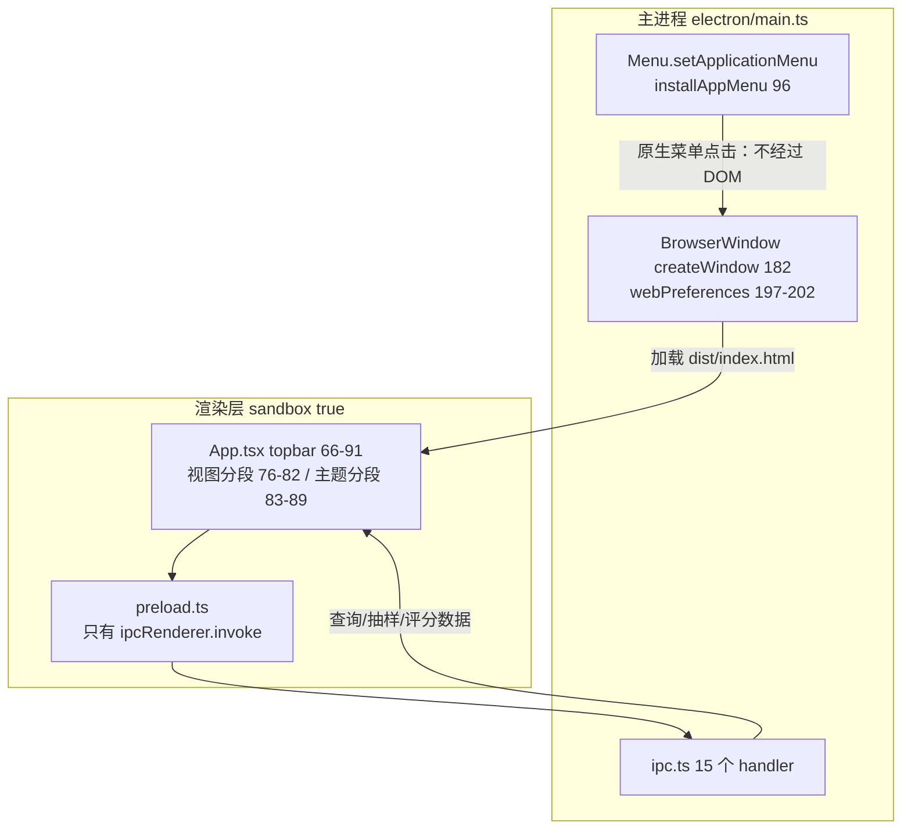

# 顶部菜单与工具栏中文化

> 范围：窗口最上面那两条"横条"——Electron 原生应用菜单（File/Edit/View/Window）与应用内 topbar（单词学习 / 主页·查询·学习 / 主题）。
> 本轮改动：原生应用菜单 1:1 中文化 + 新增定向自证挡 `npm run test:menu`。
> 实测环境：Electron 44.5.1 / Windows 11 (10.0.26300) / 系统 locale `zh-CN`。文中所有英文树与中文树都是**跑出来的**，不是抄文档（取证方式见 §7）。

---

## 0. 一分钟结论

| 问题 | 答案 |
| --- | --- |
| 截图里 `File Edit View Window` 是什么 | **Electron 原生应用菜单**，画在窗口非客户区，不在 DOM 里，渲染层拿不到它 |
| 为什么是英文 | 工程从没调用过 `Menu.setApplicationMenu`，看到的是 Electron 默认菜单。默认菜单标签写死在英文串表里：**实测本机 `app.getLocale()` 与 `app.getSystemLocale()` 都是 `zh-CN`，菜单仍是英文**（§2.3），所以"改 locale 就自动中文"不成立 |
| 应用内那条 topbar 呢 | 一直是中文（`App.tsx:79` 的 主页/查询/学习、`:20-24` 的 跟随系统/浅色/深色），本轮没动 |
| 本轮改了什么 | `electron/main.ts:96` 新增 `installAppMenu()`，`:178` 在建窗前安装；顶级 4 项 / 叶子 18 项与默认菜单逐项 1:1，行为全走 `role`，只换 `label` |
| 怎么验的 | 新增定向挡 `npm run test:menu`（`--selftest-menu`，1 条判据），**不跑全量 42 条** |
| 唯一有意的偏离 | 「最大化」：默认树里是 `role=zoom`，该 role 文档标注的是 macOS 行为，Windows 下不保证生效，所以显式绑 `isMaximized()` 切换（§5 末行） |

---

## 1. 两条"顶部"分别归谁

窗口从上到下实际有三层，只有前两层是这次话题：

| 层 | 归属进程 | 绘制者 | 本工程状态 |
| --- | --- | --- | --- |
| 标题栏（`单词学习` + 最小化/最大化/关闭） | 主进程 | Windows 非客户区（DWM） | 用默认 `frame`，未定制 `titleBarStyle` |
| **应用菜单栏**（`文件 编辑 视图 窗口`） | **主进程** | Windows 非客户区，由 Electron 提供的 `Menu` 驱动 | 本轮中文化 |
| 应用内 topbar（品牌 + 视图分段 + 主题分段） | 渲染层 | Chromium 合成，React 渲染 | 原本就是中文 |



要点：**菜单点击根本不进渲染层**，所以它不能读 React state、也不能被 CSS 改样式；反过来，topbar 的中文也不是菜单中文化能顺带解决的——两套东西、两个进程。

---

## 2. 技术框架

### 2.1 Electron Menu（原生菜单）

- 入口 API：`Menu.buildFromTemplate(template)` → `Menu.setApplicationMenu(menu)`。前者把普通对象数组实例化成 `Menu`，后者把它装到**整个应用**（Windows/Linux 上表现为每个窗口顶部那条菜单；macOS 上是屏幕顶部的系统菜单栏）。
- 项的三种形态：`{ label, submenu }`（容器）、`{ label, click }`（动作）、`{ type: 'separator' }`（分隔线）。
- **`role` 机制**是本工程的核心选择：`role: 'copy'` 之类的内置角色自带行为、自带快捷键、自带启用条件（例如没有选区时 `剪切` 自动灰掉、焦点在不可编辑区时 `粘贴` 灰掉）。这些逻辑 Electron 已经和 Chromium 编辑内核打通，**自造等价实现要重写一遍焦点/选区判断，得不偿失**。
- 快捷键记法：`CommandOrControl`（等价 `CmdOrCtrl`）、`Alt`、`Shift`、`Ctrl+Shift+I` 这类是内置角色自带的，模板里不重复写。本工程**不手写任何 accelerator**，全部由 role 提供——这样默认菜单的快捷键一个不丢、一个不多（§5 逐项核对）。
- 菜单是**应用级单例**：`Menu.getApplicationMenu()` 可在主进程随时读回当前树，这也是判据能不打 DOM 就取证的原因（§7）。

### 2.2 应用内 topbar（对比用，本轮未改）

- 技术栈：React 19.3 + zustand 5（`src/lib/store.ts` 的 `view` / `themeMode`）+ 纯 CSS（`src/styles/app.css:24` `.topbar`、`:56` `.segmented`）。**没有引入任何第三方菜单/工具栏组件库**——vendored 的 ReactBits 组件（FlipCard/GradientText/Aurora 等）都不在这条带上。
- 结构：`<header className="topbar">` 内两块 `<nav className="segmented" aria-label="视图|主题">`，用 `aria-pressed` 表达当前选中，点击直接改 store（`App.tsx:78`、`:85`）。
- 这条带的中文文案是**字面量**写在组件里的（`主页 / 查询 / 学习`、`跟随系统 / 浅色 / 深色`），没有 i18n 框架——见 §4 规范第 8 条。

### 2.3 为什么 locale 是 `zh-CN` 菜单还英文（实测）

```
check menu-labels-are-chinese PASS locale=zh-CN system=zh-CN tops=["文件","编辑","视图","窗口"] leaves=18 非中文=[]
```

同一条判据在**未安装自定义菜单**时跑出的对照是：

```
check menu-labels-are-chinese FAIL tops=["File","Edit","View","Window"] non-chinese=["File","Edit","View","Window"] items=22
```

`app.getLocale()` 与 `app.getSystemLocale()` 都返回 `zh-CN`，但默认菜单的 22 行标签全是英文。结论：**Electron 默认菜单的语言不跟随系统 locale**，中文化只能自己出模板。（`--lang` 开关会影响 Chromium 内建 UI（如输入框右键菜单）的语言，本工程未实测，列 §8。）

---

## 3. 代码结构

| 文件 | 行 | 作用 |
| --- | --- | --- |
| `electron/main.ts` | `14` | `APP_TITLE = '单词学习'`，标题栏与 `page-title-updated` 拦截（`:205`）共用 |
| | `19-21` | 三个定向挡开关：`--selftest-geometry` / `--selftest-study` / **`--selftest-menu`** |
| | `96-149` | **`installAppMenu()`**：中文模板（`Menu.setApplicationMenu` 在 `:147`），注释里写清了 1:1 口径与 `&` 助记符的取舍 |
| | `178` | 调用点：`app.whenReady()` 内、`createWindow()`（`:179`）**之前**（菜单是应用级，与窗口无关；放窗后再装会闪一下英文） |
| | `182` | `createWindow()`：`frame` 走默认、`webPreferences` `sandbox:true` / `contextIsolation:true` / `nodeIntegration:false`（`:197-202`） |
| | `413-443` | **`runMenuAudit()`**：定向挡，dump 整棵菜单树 + 1 条判据 + `MENU-AUDIT-SUMMARY`，末尾 `app.quit()`（`:442`） |
| | `226` | 分发：`MENU_AUDIT ? runMenuAudit() : STUDY_AUDIT ? runStudyAudit() : runSelfTest()` |
| `bin/selftest.mjs` | `7` | 未显式带 `--selftest` 时自动补上，所以 `--selftest-menu` 也能进 harness；`9-15` 先重新构建再跑 |
| `package.json` | scripts | **`"test:menu": "node bin/selftest.mjs --selftest-menu"`** |
| `src/components/App.tsx` | `20-24` | `MODES`：`跟随系统 / 浅色 / 深色` |
| | `66-91` | topbar：品牌 `67-74`、视图分段 `76-82`、主题分段 `83-89` |
| | `79` | 视图按钮文案 `主页 / 查询 / 学习`（本来就是中文） |
| `src/lib/store.ts` | `5` | `type View = 'home' \| 'study' \| 'search'` |
| | `66` | `setSelectedDate`；视图/主题各自的 setter 同区 |
| `src/styles/app.css` | `24-31` | `.topbar` 布局（flex + `flex-wrap`） |
| | `56-63` | `.segmented` 胶囊分段样式 |
| `electron/preload.ts` | `4-24` | 只暴露 `ipcRenderer.invoke` 的请求/响应式 API，**没有主进程→渲染层的推送通道**（§8 的增强方案要先补它） |
| `electron/ipc.ts` | `44` 等 | 15 个 `h(...)` 注册，全部是 `invoke` 侧 |

---

## 4. 实现规范（改这条菜单时逐条守）

1. **只换 `label`，不动行为。** 每一项都保留默认菜单里的 `role`；不新增功能项，不删项。判据用 `顶级=4 / 叶子=18` 把这个口径钉死（少一项或多一项都红）。
2. **行为一律走 `role`，不要手写 `click` + 快捷键。** 手写会丢掉 Electron 与 Chromium 内核打通的启用条件（无选区时剪切/复制自动灰、焦点不在可编辑区时粘贴自动灰）。唯一的例外是 `role:'zoom'`（Windows 语义不保证），已在 §5 末行标注偏离原因。
3. **不写 `&` 助记符。** 英文 `&File` 提供 Alt+F；中文标签没有单字助记符惯例，`'&文件'` 会把 `&` 按字面显示出来。Alt 聚焦菜单条本身不受影响（属肉眼验收项，见 §7.3）。
4. **顶级项不给 `role`。** `role:'fileMenu'` 这类子菜单角色的作用是让 Electron 自动填一份**英文**子菜单；我们既然显式给了 `submenu`，就不该再挂它（对照默认树时顶级 `role=filemenu` 会消失，这是预期的，判据不依赖它）。
5. **安装时机在 `whenReady()` 内、`createWindow()` 之前。** `Menu.setApplicationMenu` 是应用级；晚装会让首帧显示英文。
6. **菜单不进渲染层，DOM 探针不判菜单。** 判据只能在主进程读 `Menu.getApplicationMenu()`。别试图用 `executeJavaScript` 找它——它压根不在文档里。
7. **改这一面只跑定向挡。** `npm run test:menu`（1 条判据 + 整树留证）。全量 42 条只在整轮收口时跑。
8. **定向挡必须自己收尾 `app.quit()`。** 不做的话窗口一直开着，被 `bin/selftest.mjs:16` 的 300 s 超时 SIGTERM 掉，**判据全绿也拿不到退出码 0**（本轮实测踩过：`SELFTEST-OK` 后面跟着 `SELFTEST-TIMEOUT killed by signal=SIGTERM`，`npm run test:menu` 返回 1；补上收尾后同一命令 20 s 内返回、退出码 0）。另三处收尾在 `main.ts:237 / :740 / :1783`。
9. **不做多语言框架。** 本工程交付中文单版本（与 README 文档口径一致），菜单文案就是中文字面量；将来若要 en/zh 双语，再统一抽模板，不要现在塞一层 i18n。
10. **分隔线位置按 Windows 惯例**：编辑里 `重做|剪切` 与 `删除|全选` 之间、视图里 `开发者工具|实际大小` 与 `缩小|全屏` 之间，各一条。分隔线不计入叶子数。

---

## 5. 英文 → 中文完整对照表

左列是**实测 dump 出来的默认菜单**（改前，22 行含 4 个顶级），右列是本轮落地后的实测树（改后）。`快捷键` 列两份 dump 完全一致：**15 项带键、3 项不带键，逐项对得上**。

| 英文（默认） | 中文（本轮） | role | 快捷键 | 说明 |
| --- | --- | --- | --- | --- |
| File | 文件 | 顶级不给 role | — | 默认树里是 `role=filemenu`，见 §4 第 4 条 |
| Exit | 退出 | `quit` | 无 | 与默认一致（默认也没给 Ctrl+Q） |
| Edit | 编辑 | — | — | |
| Undo | 撤销 | `undo` | `CommandOrControl+Z` | |
| Redo | 重做 | `redo` | `Control+Y` | Windows 用 `Ctrl+Y`，不是 `Ctrl+Shift+Z` |
| Cut | 剪切 | `cut` | `CommandOrControl+X` | |
| Copy | 复制 | `copy` | `CommandOrControl+C` | |
| Paste | 粘贴 | `paste` | `CommandOrControl+V` | |
| Delete | 删除 | `delete` | 无 | 默认也没有键 |
| Select All | 全选 | `selectall` | `CommandOrControl+A` | |
| View | 视图 | — | — | |
| Reload | 重新加载 | `reload` | `CmdOrCtrl+R` | |
| Force Reload | 强制重新加载 | `forcereload` | `Shift+CmdOrCtrl+R` | |
| Toggle Developer Tools | 切换开发者工具 | `toggledevtools` | `Ctrl+Shift+I` | 与默认保持一致保留在菜单里；发布版是否摘掉见 §8 |
| Actual Size | 实际大小 | `resetzoom` | `CommandOrControl+0` | |
| Zoom In | 放大 | `zoomin` | `CommandOrControl+Plus` | |
| Zoom Out | 缩小 | `zoomout` | `CommandOrControl+-` | |
| Toggle Full Screen | 进入或退出全屏 | `togglefullscreen` | `F11` | 用"或"不用"/"，避免与菜单分隔符混淆 |
| Window | 窗口 | — | — | |
| Minimize | 最小化 | `minimize` | `CommandOrControl+M` | |
| Zoom | 最大化 | **无 role，自绑 `click`** | 无 | **唯一偏离**：`role:'zoom'` 文档标注 macOS 语义，Windows 不保证生效；这里显式 `isMaximized() ? unmaximize() : maximize()` |
| Close | 关闭 | `close` | `CommandOrControl+W` | |

译法取的是中文 Windows / Chrome 中文版的既有叫法（`实际大小`、`强制重新加载`、`进入或退出全屏`），不自己造词。

---

## 6. 落地实现（关键片段）

`electron/main.ts:96-149`，节选（完整以文件为准）：

```ts
function installAppMenu(): void {
  const template: MenuItemConstructorOptions[] = [
    { label: '文件', submenu: [{ role: 'quit', label: '退出' }] },
    {
      label: '编辑',
      submenu: [
        { role: 'undo', label: '撤销' },
        { role: 'redo', label: '重做' },
        { type: 'separator' },
        { role: 'cut', label: '剪切' },
        { role: 'copy', label: '复制' },
        { role: 'paste', label: '粘贴' },
        { role: 'delete', label: '删除' },
        { type: 'separator' },
        { role: 'selectAll', label: '全选' }
      ]
    },
    /* 视图 / 窗口 同构，见 §5 */
  ];
  Menu.setApplicationMenu(Menu.buildFromTemplate(template));
}
```

调用点（`electron/main.ts:178-179`，`app.whenReady()` 回调末尾）：

```ts
    installAppMenu();
    createWindow();
```

`窗口 › 最大化` 的偏离项：

```ts
{
  label: '最大化',
  click: () => {
    const w = BrowserWindow.getFocusedWindow() ?? BrowserWindow.getAllWindows()[0];
    if (!w) return;
    if (w.isMaximized()) w.unmaximize();
    else w.maximize();
  }
}
```

---

## 7. 验证

### 7.1 定向挡（本轮用的就是这条）

```
npm run typecheck        # tsc 两个工程都过
npm run test:menu        # 只跑菜单，1 条判据 + 整树 dump；约 20 s 返回，退出码 0
```

判据 `menu-labels-are-chinese`（`electron/main.ts:413-443`）断三件事，任一不满足即红：

1. 顶级恰好 4 项；
2. 叶子恰好 18 项（与默认菜单**不增不减**）；
3. 除分隔线外没有任何一行标签不含中日韩汉字。

实测输出（改后）：

```
check menu-labels-are-chinese PASS locale=zh-CN system=zh-CN tops=["文件","编辑","视图","窗口"] leaves=18 非中文=[]
MENU-AUDIT-SUMMARY checks=1 pass=1 fail=0 mode=menu-audit
SELFTEST-OK
```

### 7.2 对照（证伪能力）

对照跑的是**改前状态**（不装 `installAppMenu`，走 Electron 默认菜单），同一条判据当场翻红，并留下 22 行英文树作为 §5 对照表的原始凭证：

```
check menu-labels-are-chinese FAIL tops=["File","Edit","View","Window"] non-chinese=["File","Edit","View","Window"] items=22
```

叶子数 18 这条尤其重要：它排掉"翻着翻着少了一项/自己多加一项"的静默漂移——将来谁改模板，判据会要求他同时说明为什么项数变了。

### 7.3 肉眼验收（判据证不到的部分）

判据读的是主进程里的菜单树对象，**证不到像素与手感**。请人工过这四项：

1. 顶部菜单条显示 `文件 编辑 视图 窗口`，无残留英文；
2. 按 `Alt` 能聚焦菜单条、方向键能逐项走、`Esc` 能退出；
3. `编辑` 里在无选区的空白处点 `剪切/复制` 应是灰的，在查询框里选中文字后应变亮（role 的启用条件）；
4. `窗口 › 最大化` 点一次最大化、再点一次还原。

---

## 8. 已知边界与后续（都还没做）

| 项 | 现状 | 要不要做 |
| --- | --- | --- |
| 输入框右键菜单 | 工程未注册 `context-menu` 处理，走 Chromium 原生菜单；其显示语言**本轮未实测** | 若实测为英文，两条路：`app.commandLine.appendSwitch('lang','zh-CN')`（影响面待评估），或自己出 `Menu.buildFromTemplate` 的 `popup()` |
| `切换开发者工具` 留在菜单里 | 与默认菜单 1:1 才保留；本工程 `dev`/打包产物都开得到 | 发布版若要摘掉，属**行为变更**，要连同 §4 第 1 条的 1:1 口径一起改，并把判据的 `leaves===18` 同步改成 17 |
| 菜单里加"跳到 主页/查询/学习" | 没做。需要**主进程→渲染层**的推送通道：`preload.ts` 目前只有 `ipcRenderer.invoke`，要加 `ipcRenderer.on` + `webContents.send`，再在 `store.ts` 落一个 action | 这是新功能，不是中文化；要做请单开一轮 |
| 任务栏/关于/应用名 | 标题栏与任务栏名称走 `APP_TITLE='单词学习'`（`main.ts:14`）与 `package.json` 的 `productName`；本轮未动 | 打包产物名已中文，无需改 |
| 多语言 | 不做（§4 第 8 条） | 若将来要 en/zh 切换，把模板抽成函数 `buildMenu(locale)`，而不是在 label 里做条件拼接 |
| `--selftest-menu` 未进文档索引 | 本文 §7.1 是它的第一份说明 | 下一轮同步 `doc/运行与构建（T0Level）.md` 与 README 的命令表时一并补（那两处目前还写着"全局 39 条"的旧口径） |

---

## 附：本文所有数字的复现命令

```bash
npm run test:menu                 # 中文树 + 判据（改后）
node -e "console.log(require('electron/package.json').version)"   # 44.5.1
```

改前那份英文树：临时注释 `electron/main.ts:178` 的 `installAppMenu();` 再跑一次 `npm run test:menu`，
日志里的 22 行 `menu ...` 就是 §5 左列的来源（本轮已跑过，输出见 §7.2）。
